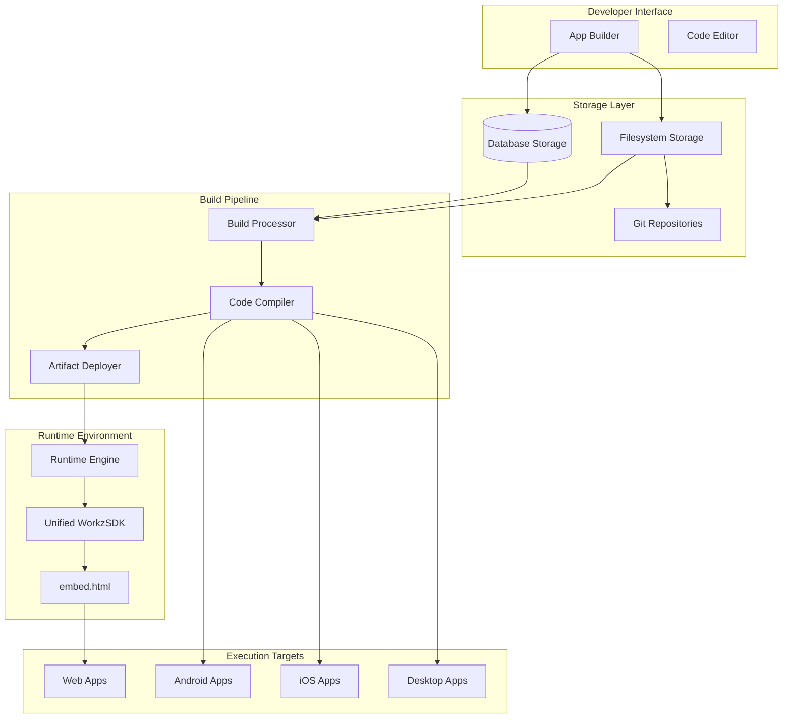
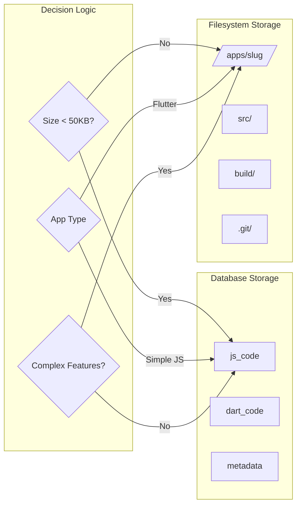
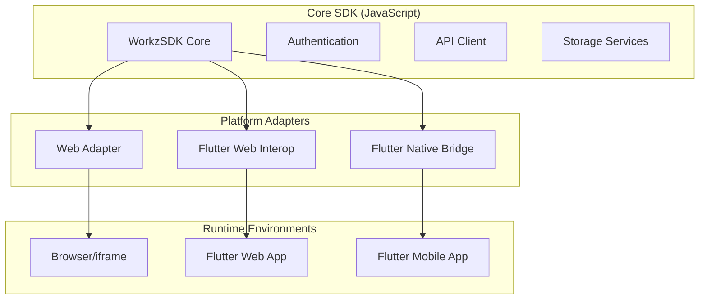
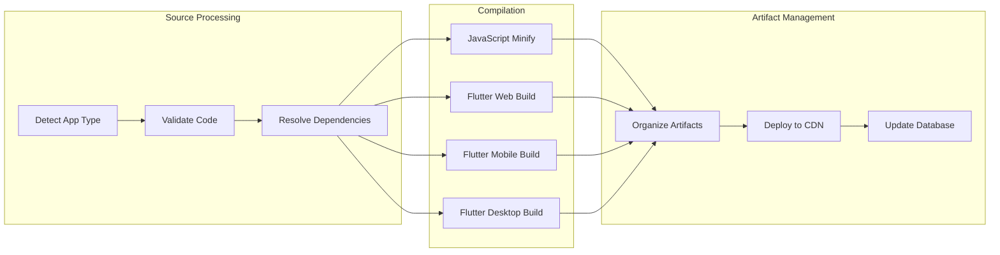

# Unified App Architecture Design

## Overview

The Unified App Architecture provides a seamless development and execution environment for both JavaScript and Flutter applications within the Workz! platform. The design implements a hybrid storage strategy, unified SDK, and optimized build pipeline that scales from simple prototypes to complex multi-platform applications.

## Architecture

### High-Level Architecture



### Storage Architecture



## Components and Interfaces

### 1. Storage Manager

**Purpose**: Manages the hybrid storage system and automatic migration between database and filesystem storage.

**Key Methods**:
- `getAppCode(appId: string): Promise<AppCode>`
- `saveAppCode(appId: string, code: AppCode): Promise<void>`
- `migrateToFilesystem(appId: string): Promise<void>`
- `migrateToDatabase(appId: string): Promise<void>`

**Storage Decision Logic**:
```typescript
interface StorageDecision {
  type: 'database' | 'filesystem';
  reason: 'size' | 'complexity' | 'features' | 'manual';
  threshold: number;
}

function determineStorageType(app: AppMetadata): StorageDecision {
  if (app.codeSize > STORAGE_THRESHOLD) {
    return { type: 'filesystem', reason: 'size', threshold: STORAGE_THRESHOLD };
  }
  
  if (app.appType === 'flutter') {
    return { type: 'filesystem', reason: 'complexity', threshold: 0 };
  }
  
  if (app.features.includes('git') || app.features.includes('collaboration')) {
    return { type: 'filesystem', reason: 'features', threshold: 0 };
  }
  
  return { type: 'database', reason: 'size', threshold: STORAGE_THRESHOLD };
}
```

### 2. Unified WorkzSDK

**Architecture**: Single JavaScript SDK with platform-specific adapters



**Flutter Web Integration**:
```dart
// Flutter calls JavaScript SDK through interop
@JS('WorkzSDK')
external WorkzSDKJS get workzSDK;

class WorkzSDK {
  static Future<void> init({required String apiUrl, required String token}) async {
    await promiseToFuture(workzSDK.init({'apiUrl': apiUrl, 'token': token}));
  }
  
  static Future<String?> kvGet(String key) async {
    return await promiseToFuture(workzSDK.kv.get(key));
  }
}
```

### 3. Build Pipeline

**Multi-Stage Pipeline**:



**Build Configuration**:
```json
{
  "buildTargets": {
    "javascript": ["web"],
    "flutter": ["web", "android", "ios", "windows", "macos", "linux"]
  },
  "outputPaths": {
    "web": "/apps/{slug}/build/web/",
    "android": "/apps/{slug}/build/android/",
    "ios": "/apps/{slug}/build/ios/",
    "windows": "/apps/{slug}/build/windows/",
    "macos": "/apps/{slug}/build/macos/",
    "linux": "/apps/{slug}/build/linux/"
  }
}
```

### 4. Runtime Engine

**Unified Execution Environment**:

```typescript
class RuntimeEngine {
  async loadApp(appId: string, platform: Platform): Promise<AppInstance> {
    const app = await this.getAppMetadata(appId);
    const storage = this.getStorageManager();
    
    if (app.storageType === 'database') {
      return this.loadFromDatabase(app, platform);
    } else {
      return this.loadFromFilesystem(app, platform);
    }
  }
  
  private async loadFromDatabase(app: AppMetadata, platform: Platform): Promise<AppInstance> {
    const code = await this.database.getAppCode(app.id);
    return this.createAppInstance(code, platform);
  }
  
  private async loadFromFilesystem(app: AppMetadata, platform: Platform): Promise<AppInstance> {
    const artifactPath = this.getArtifactPath(app.slug, platform);
    const artifact = await this.filesystem.readArtifact(artifactPath);
    return this.createAppInstance(artifact, platform);
  }
}
```

## Data Models

### Enhanced Apps Table Schema

```sql
ALTER TABLE apps ADD COLUMN storage_type ENUM('database', 'filesystem') DEFAULT 'database';
ALTER TABLE apps ADD COLUMN repository_path VARCHAR(255) NULL;
ALTER TABLE apps ADD COLUMN code_size_bytes BIGINT DEFAULT 0;
ALTER TABLE apps ADD COLUMN last_migration_at TIMESTAMP NULL;
ALTER TABLE apps ADD COLUMN git_branch VARCHAR(100) DEFAULT 'main';
ALTER TABLE apps ADD COLUMN git_commit_hash VARCHAR(40) NULL;

-- Index for efficient storage type queries
CREATE INDEX idx_apps_storage_type ON apps(storage_type);
CREATE INDEX idx_apps_repository_path ON apps(repository_path);
```

### Filesystem Structure

```
/apps/
├── [slug]/
│   ├── .git/                    # Git repository
│   ├── src/                     # Source code
│   │   ├── main.js             # JavaScript entry
│   │   ├── main.dart           # Flutter entry
│   │   ├── lib/                # Flutter libraries
│   │   └── assets/             # Static assets
│   ├── build/                   # Compiled artifacts
│   │   ├── web/                # Web build (JS + Flutter web)
│   │   │   ├── index.html
│   │   │   ├── main.js
│   │   │   └── assets/
│   │   ├── android/            # Android APK
│   │   ├── ios/                # iOS IPA
│   │   ├── windows/            # Windows executable
│   │   ├── macos/              # macOS app
│   │   └── linux/              # Linux executable
│   ├── workz.json              # App configuration
│   ├── pubspec.yaml            # Flutter dependencies
│   ├── package.json            # JavaScript dependencies
│   └── README.md               # Documentation
```

### App Configuration (workz.json)

```json
{
  "name": "My App",
  "slug": "my-app",
  "version": "1.0.0",
  "appType": "flutter",
  "storageType": "filesystem",
  "buildTargets": ["web", "android", "ios"],
  "workzSDK": {
    "version": "^2.0.0",
    "scopes": ["profile.read", "storage.kv.write"]
  },
  "git": {
    "branch": "main",
    "lastCommit": "abc123def456"
  },
  "build": {
    "lastBuildAt": "2025-01-15T10:30:00Z",
    "status": "success",
    "artifacts": {
      "web": "/apps/my-app/build/web/",
      "android": "/apps/my-app/build/android/app.apk",
      "ios": "/apps/my-app/build/ios/app.ipa"
    }
  }
}
```

## Error Handling

### Storage Migration Errors

```typescript
class StorageMigrationError extends Error {
  constructor(
    public appId: string,
    public fromType: StorageType,
    public toType: StorageType,
    public reason: string
  ) {
    super(`Migration failed for app ${appId}: ${reason}`);
  }
}

class MigrationService {
  async migrateApp(appId: string, targetType: StorageType): Promise<void> {
    const transaction = await this.database.beginTransaction();
    
    try {
      // 1. Backup current state
      const backup = await this.createBackup(appId);
      
      // 2. Perform migration
      if (targetType === 'filesystem') {
        await this.migrateToFilesystem(appId);
      } else {
        await this.migrateToDatabase(appId);
      }
      
      // 3. Validate migration
      await this.validateMigration(appId, targetType);
      
      // 4. Update database
      await this.updateAppStorageType(appId, targetType);
      
      await transaction.commit();
      
      // 5. Cleanup backup
      await this.cleanupBackup(backup);
      
    } catch (error) {
      await transaction.rollback();
      await this.restoreFromBackup(appId, backup);
      throw new StorageMigrationError(appId, 'database', targetType, error.message);
    }
  }
}
```

### Build Pipeline Error Handling

```typescript
interface BuildResult {
  success: boolean;
  artifacts: Record<Platform, string>;
  errors: BuildError[];
  warnings: string[];
  duration: number;
}

class BuildError {
  constructor(
    public platform: Platform,
    public stage: BuildStage,
    public message: string,
    public code?: string
  ) {}
}

class BuildPipeline {
  async buildApp(appId: string): Promise<BuildResult> {
    const result: BuildResult = {
      success: false,
      artifacts: {},
      errors: [],
      warnings: [],
      duration: 0
    };
    
    const startTime = Date.now();
    
    try {
      const app = await this.getApp(appId);
      const targets = this.getBuildTargets(app.appType);
      
      for (const target of targets) {
        try {
          const artifact = await this.buildForPlatform(app, target);
          result.artifacts[target] = artifact;
        } catch (error) {
          result.errors.push(new BuildError(target, 'compile', error.message));
        }
      }
      
      result.success = result.errors.length === 0;
      
    } catch (error) {
      result.errors.push(new BuildError('all', 'setup', error.message));
    } finally {
      result.duration = Date.now() - startTime;
    }
    
    return result;
  }
}
```

## Testing Strategy

### Unit Testing

**Storage Manager Tests**:
- Test storage type determination logic
- Test migration between storage types
- Test backup and restore functionality
- Test error handling and rollback

**Build Pipeline Tests**:
- Test compilation for each platform
- Test artifact organization and deployment
- Test build caching and incremental builds
- Test error handling and recovery

**Runtime Engine Tests**:
- Test app loading from both storage types
- Test SDK initialization and API calls
- Test platform-specific execution paths
- Test performance and caching

### Integration Testing

**End-to-End App Lifecycle**:
1. Create app in App Builder
2. Save code (test both storage paths)
3. Trigger build pipeline
4. Deploy and execute app
5. Test SDK functionality
6. Test migration between storage types

**Cross-Platform Testing**:
- Test Flutter web apps in embed.html
- Test JavaScript apps with unified SDK
- Test native Flutter apps with SDK bridge
- Test artifact deployment and CDN serving

### Performance Testing

**Storage Performance**:
- Compare database vs filesystem load times
- Test migration performance with large apps
- Test concurrent access patterns
- Test backup and restore performance

**Build Performance**:
- Test incremental vs full builds
- Test parallel compilation
- Test artifact caching effectiveness
- Test CDN deployment speed

**Runtime Performance**:
- Test app startup times
- Test SDK initialization overhead
- Test memory usage patterns
- Test concurrent app execution