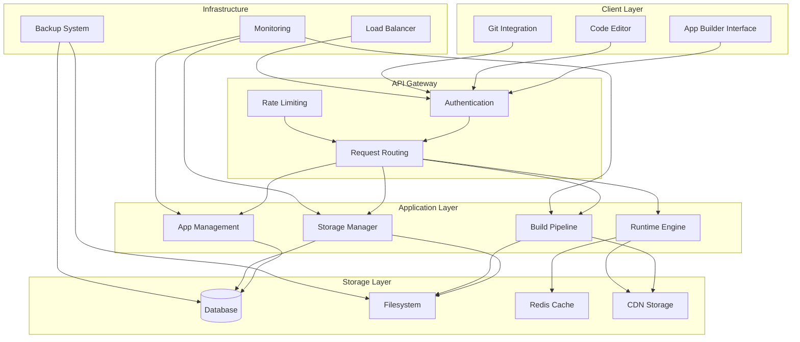
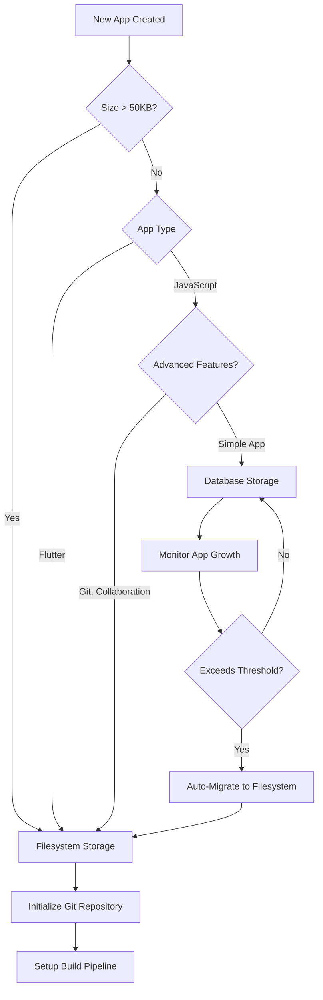
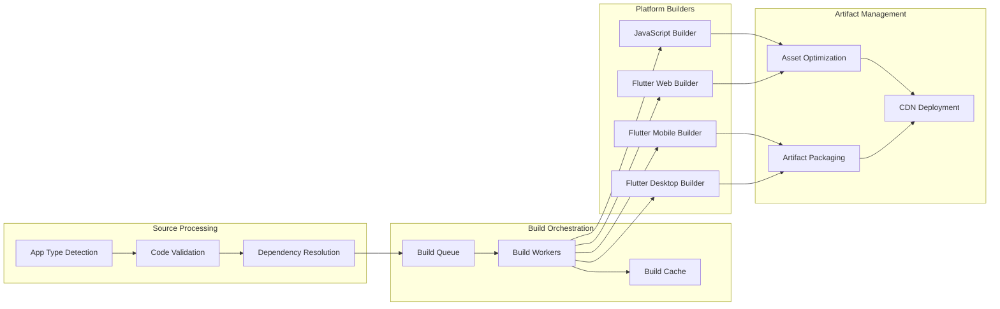

# Workz! Unified Architecture Documentation

## Overview

The Workz! Unified Architecture provides a scalable, flexible platform for building and deploying applications across multiple platforms. The architecture supports both JavaScript and Flutter applications with intelligent storage management, automated build pipelines, and optimized runtime execution.

## Core Architecture Principles

### 1. Hybrid Storage Strategy
- **Small, simple apps**: Database storage for immediate execution
- **Large, complex apps**: Filesystem storage with Git version control
- **Automatic migration**: Seamless transition between storage types based on app characteristics

### 2. Unified SDK Experience
- **Single API**: Consistent interface across JavaScript and Flutter
- **Platform Adaptation**: Automatic platform detection and optimization
- **Cross-Platform Compatibility**: Write once, run everywhere

### 3. Intelligent Build Pipeline
- **Multi-Platform Builds**: Support for web, mobile, and desktop targets
- **Optimization**: Automatic code minification, asset optimization, and caching
- **Incremental Builds**: Fast rebuilds using intelligent change detection

## System Architecture



## Hybrid Storage System

### Storage Decision Logic

The system automatically determines the optimal storage strategy based on multiple factors:



### Database Storage Architecture

**Use Cases**:
- Apps < 50KB in size
- Simple JavaScript applications
- Rapid prototyping and development
- Apps without version control needs

**Storage Schema**:
```sql
-- Apps table with storage metadata
CREATE TABLE apps (
    id VARCHAR(36) PRIMARY KEY,
    name VARCHAR(255) NOT NULL,
    slug VARCHAR(100) UNIQUE NOT NULL,
    user_id VARCHAR(36) NOT NULL,
    
    -- Storage configuration
    storage_type ENUM('database', 'filesystem') DEFAULT 'database',
    repository_path VARCHAR(255) NULL,
    code_size_bytes BIGINT DEFAULT 0,
    
    -- Code storage (for database-stored apps)
    js_code LONGTEXT NULL,
    dart_code LONGTEXT NULL,
    html_template LONGTEXT NULL,
    css_styles LONGTEXT NULL,
    
    -- Metadata
    app_type ENUM('javascript', 'flutter') DEFAULT 'javascript',
    created_at TIMESTAMP DEFAULT CURRENT_TIMESTAMP,
    updated_at TIMESTAMP DEFAULT CURRENT_TIMESTAMP ON UPDATE CURRENT_TIMESTAMP,
    
    -- Migration tracking
    last_migration_at TIMESTAMP NULL,
    migration_status ENUM('none', 'pending', 'in_progress', 'completed', 'failed') DEFAULT 'none',
    
    -- Git integration (for filesystem apps)
    git_branch VARCHAR(100) DEFAULT 'main',
    git_commit_hash VARCHAR(40) NULL,
    
    -- Build pipeline
    last_build_at TIMESTAMP NULL,
    build_status ENUM('none', 'pending', 'building', 'success', 'failed') DEFAULT 'none',
    
    INDEX idx_storage_type (storage_type),
    INDEX idx_user_storage (user_id, storage_type),
    INDEX idx_size_threshold (code_size_bytes),
    INDEX idx_build_status (build_status)
);

-- Build artifacts tracking
CREATE TABLE build_artifacts (
    id VARCHAR(36) PRIMARY KEY,
    app_id VARCHAR(36) NOT NULL,
    platform ENUM('web', 'android', 'ios', 'windows', 'macos', 'linux') NOT NULL,
    artifact_path VARCHAR(500) NOT NULL,
    file_size BIGINT NOT NULL,
    build_hash VARCHAR(64) NOT NULL,
    created_at TIMESTAMP DEFAULT CURRENT_TIMESTAMP,
    
    FOREIGN KEY (app_id) REFERENCES apps(id) ON DELETE CASCADE,
    INDEX idx_app_platform (app_id, platform),
    INDEX idx_build_hash (build_hash)
);
```

**Performance Characteristics**:
- **Read Latency**: < 10ms (direct database query)
- **Write Latency**: < 50ms (single transaction)
- **Scalability**: Up to 100,000 small apps per database instance
- **Backup**: Included in regular database backups

### Filesystem Storage Architecture

**Use Cases**:
- Apps > 50KB in size
- Flutter applications (all sizes)
- Apps requiring Git version control
- Collaborative development projects
- Multi-platform applications

**Directory Structure**:
```
/apps/
├── [app-slug]/
│   ├── .git/                    # Git repository
│   │   ├── hooks/               # Git hooks for automation
│   │   └── ...
│   ├── .workz/                  # Workz-specific configuration
│   │   ├── config.json          # App configuration
│   │   ├── build-cache/         # Build cache directory
│   │   └── deployment/          # Deployment configurations
│   ├── src/                     # Source code
│   │   ├── main.js              # JavaScript entry point
│   │   ├── main.dart            # Flutter entry point
│   │   ├── lib/                 # Flutter libraries
│   │   │   ├── models/
│   │   │   ├── services/
│   │   │   ├── widgets/
│   │   │   └── utils/
│   │   ├── web/                 # Web-specific assets
│   │   │   ├── index.html
│   │   │   ├── manifest.json
│   │   │   └── icons/
│   │   ├── assets/              # Static assets
│   │   │   ├── images/
│   │   │   ├── fonts/
│   │   │   └── data/
│   │   └── test/                # Test files
│   ├── build/                   # Compiled artifacts
│   │   ├── web/                 # Web build output
│   │   │   ├── index.html
│   │   │   ├── main.dart.js     # Compiled Dart
│   │   │   ├── assets/          # Processed assets
│   │   │   └── canvaskit/       # Flutter web runtime
│   │   ├── android/             # Android build output
│   │   │   ├── app-release.apk
│   │   │   └── app-debug.apk
│   │   ├── ios/                 # iOS build output
│   │   │   ├── Runner.ipa
│   │   │   └── Runner.app/
│   │   ├── windows/             # Windows build output
│   │   ├── macos/               # macOS build output
│   │   └── linux/               # Linux build output
│   ├── workz.json               # Workz app configuration
│   ├── pubspec.yaml             # Flutter dependencies (if Flutter app)
│   ├── package.json             # JavaScript dependencies (if JS app)
│   ├── README.md                # App documentation
│   └── .gitignore               # Git ignore rules
```

**Performance Characteristics**:
- **Read Latency**: < 50ms (filesystem + Git operations)
- **Write Latency**: < 200ms (filesystem + Git commit)
- **Scalability**: Up to 10,000 apps per filesystem instance
- **Backup**: Git repositories + filesystem snapshots

### Storage Manager Implementation

```php
<?php
// src/Core/StorageManager.php

class StorageManager {
    private $database;
    private $filesystem;
    private $gitManager;
    private $config;
    
    public function __construct(
        DatabaseInterface $database,
        FilesystemInterface $filesystem,
        GitManager $gitManager,
        array $config
    ) {
        $this->database = $database;
        $this->filesystem = $filesystem;
        $this->gitManager = $gitManager;
        $this->config = $config;
    }
    
    /**
     * Determine optimal storage type for an app
     */
    public function determineStorageType(array $appData): string {
        $size = $this->calculateCodeSize($appData);
        $threshold = $this->config['storage_threshold'] ?? 51200; // 50KB
        
        // Size-based decision
        if ($size > $threshold) {
            return 'filesystem';
        }
        
        // App type-based decision
        if ($appData['app_type'] === 'flutter') {
            return 'filesystem';
        }
        
        // Feature-based decision
        $features = $appData['features'] ?? [];
        if (in_array('git', $features) || in_array('collaboration', $features)) {
            return 'filesystem';
        }
        
        return 'database';
    }
    
    /**
     * Get app code regardless of storage type
     */
    public function getAppCode(string $appId): array {
        $app = $this->database->getApp($appId);
        
        if ($app['storage_type'] === 'database') {
            return $this->getCodeFromDatabase($app);
        } else {
            return $this->getCodeFromFilesystem($app);
        }
    }
    
    /**
     * Save app code to appropriate storage
     */
    public function saveAppCode(string $appId, array $code, array $options = []): bool {
        $app = $this->database->getApp($appId);
        $newSize = $this->calculateCodeSize($code);
        
        // Check if migration is needed
        $currentStorageType = $app['storage_type'];
        $optimalStorageType = $this->determineStorageType(array_merge($app, $code));
        
        if ($currentStorageType !== $optimalStorageType && !($options['force_storage'] ?? false)) {
            // Trigger automatic migration
            $this->migrateApp($appId, $optimalStorageType);
            $app['storage_type'] = $optimalStorageType;
        }
        
        // Update size tracking
        $this->database->updateAppSize($appId, $newSize);
        
        if ($app['storage_type'] === 'database') {
            return $this->saveCodeToDatabase($appId, $code, $options);
        } else {
            return $this->saveCodeToFilesystem($appId, $code, $options);
        }
    }
    
    /**
     * Migrate app between storage types
     */
    public function migrateApp(string $appId, string $targetStorage): bool {
        $app = $this->database->getApp($appId);
        
        if ($app['storage_type'] === $targetStorage) {
            return true; // Already using target storage
        }
        
        $this->database->updateMigrationStatus($appId, 'in_progress');
        
        try {
            // Create backup
            $backup = $this->createBackup($appId);
            
            if ($targetStorage === 'filesystem') {
                $success = $this->migrateToFilesystem($appId);
            } else {
                $success = $this->migrateToDatabase($appId);
            }
            
            if ($success) {
                $this->database->updateStorageType($appId, $targetStorage);
                $this->database->updateMigrationStatus($appId, 'completed');
                $this->cleanupBackup($backup);
                return true;
            } else {
                $this->restoreFromBackup($appId, $backup);
                $this->database->updateMigrationStatus($appId, 'failed');
                return false;
            }
            
        } catch (Exception $e) {
            $this->database->updateMigrationStatus($appId, 'failed');
            error_log("Migration failed for app {$appId}: " . $e->getMessage());
            return false;
        }
    }
    
    private function migrateToFilesystem(string $appId): bool {
        $app = $this->database->getApp($appId);
        $code = $this->getCodeFromDatabase($app);
        
        // Create filesystem structure
        $appPath = $this->getAppPath($app['slug']);
        $this->filesystem->createDirectory($appPath);
        
        // Initialize Git repository
        $this->gitManager->initRepository($appPath);
        
        // Write source files
        $this->writeSourceFiles($appPath, $code);
        
        // Create configuration files
        $this->createConfigFiles($appPath, $app);
        
        // Initial Git commit
        $this->gitManager->commit($appPath, 'Initial migration from database storage');
        
        // Update database record
        $this->database->updateRepositoryPath($appId, $appPath);
        
        return true;
    }
    
    private function migrateToDatabase(string $appId): bool {
        $app = $this->database->getApp($appId);
        $code = $this->getCodeFromFilesystem($app);
        
        // Flatten filesystem structure for database storage
        $flattenedCode = $this->flattenCode($code);
        
        // Validate size constraints
        $size = $this->calculateCodeSize($flattenedCode);
        if ($size > $this->config['max_database_size']) {
            throw new Exception("App too large for database storage: {$size} bytes");
        }
        
        // Save to database
        $this->saveCodeToDatabase($appId, $flattenedCode);
        
        // Archive filesystem version
        $this->archiveFilesystemVersion($app['repository_path']);
        
        // Clear repository path
        $this->database->updateRepositoryPath($appId, null);
        
        return true;
    }
}
```

## Build Pipeline System

### Pipeline Architecture



### Build Pipeline Implementation

```php
<?php
// src/Core/BuildPipeline.php

class BuildPipeline {
    private $builders = [];
    private $cache;
    private $queue;
    private $artifactManager;
    
    public function __construct(
        BuildCache $cache,
        QueueInterface $queue,
        ArtifactManager $artifactManager
    ) {
        $this->cache = $cache;
        $this->queue = $queue;
        $this->artifactManager = $artifactManager;
        
        // Register platform builders
        $this->builders['javascript'] = new JavaScriptBuilder();
        $this->builders['flutter'] = new FlutterBuilder();
    }
    
    /**
     * Trigger build for an app
     */
    public function buildApp(string $appId, array $options = []): string {
        $buildId = $this->generateBuildId();
        
        // Queue build job
        $job = [
            'build_id' => $buildId,
            'app_id' => $appId,
            'options' => $options,
            'timestamp' => time()
        ];
        
        $this->queue->push('build_queue', $job);
        
        // Update build status
        $this->updateBuildStatus($appId, $buildId, 'pending');
        
        return $buildId;
    }
    
    /**
     * Process build job (called by queue worker)
     */
    public function processBuildJob(array $job): bool {
        $buildId = $job['build_id'];
        $appId = $job['app_id'];
        $options = $job['options'];
        
        try {
            $this->updateBuildStatus($appId, $buildId, 'building');
            
            // Get app and source code
            $app = $this->getApp($appId);
            $sourceCode = $this->getSourceCode($app);
            
            // Determine build targets
            $targets = $this->getBuildTargets($app, $options);
            
            $artifacts = [];
            
            foreach ($targets as $target) {
                $builder = $this->getBuilder($app['app_type']);
                
                // Check cache first
                $cacheKey = $this->generateCacheKey($app, $target, $sourceCode);
                $cachedArtifact = $this->cache->get($cacheKey);
                
                if ($cachedArtifact && !($options['force_rebuild'] ?? false)) {
                    $artifacts[$target] = $cachedArtifact;
                    continue;
                }
                
                // Build for target platform
                $artifact = $builder->build($sourceCode, $target, $options);
                
                if ($artifact) {
                    // Cache the artifact
                    $this->cache->set($cacheKey, $artifact);
                    $artifacts[$target] = $artifact;
                } else {
                    throw new Exception("Build failed for target: {$target}");
                }
            }
            
            // Deploy artifacts
            $deploymentUrls = $this->artifactManager->deployArtifacts($appId, $artifacts);
            
            // Update build record
            $this->updateBuildRecord($appId, $buildId, [
                'status' => 'success',
                'artifacts' => $deploymentUrls,
                'completed_at' => date('Y-m-d H:i:s')
            ]);
            
            return true;
            
        } catch (Exception $e) {
            $this->updateBuildRecord($appId, $buildId, [
                'status' => 'failed',
                'error' => $e->getMessage(),
                'completed_at' => date('Y-m-d H:i:s')
            ]);
            
            error_log("Build failed for app {$appId}: " . $e->getMessage());
            return false;
        }
    }
    
    private function getBuildTargets(array $app, array $options): array {
        $defaultTargets = [
            'javascript' => ['web'],
            'flutter' => ['web', 'android', 'ios']
        ];
        
        $appType = $app['app_type'];
        $targets = $options['targets'] ?? $defaultTargets[$appType] ?? ['web'];
        
        // Filter based on app configuration
        if (isset($app['build_config']['targets'])) {
            $targets = array_intersect($targets, $app['build_config']['targets']);
        }
        
        return $targets;
    }
    
    private function generateCacheKey(array $app, string $target, array $sourceCode): string {
        $content = json_encode([
            'app_id' => $app['id'],
            'target' => $target,
            'source_hash' => md5(serialize($sourceCode)),
            'app_config' => $app['build_config'] ?? []
        ]);
        
        return 'build_cache:' . md5($content);
    }
}
```

### JavaScript Builder

```php
<?php
// src/Core/JavaScriptBuilder.php

class JavaScriptBuilder implements BuilderInterface {
    private $minifier;
    private $bundler;
    
    public function build(array $sourceCode, string $target, array $options = []): ?array {
        switch ($target) {
            case 'web':
                return $this->buildWeb($sourceCode, $options);
            default:
                throw new Exception("Unsupported target for JavaScript: {$target}");
        }
    }
    
    private function buildWeb(array $sourceCode, array $options): array {
        $buildDir = $this->createBuildDirectory();
        
        try {
            // Process JavaScript files
            $jsFiles = $this->extractJavaScriptFiles($sourceCode);
            $processedJs = $this->processJavaScript($jsFiles, $options);
            
            // Process CSS files
            $cssFiles = $this->extractCSSFiles($sourceCode);
            $processedCss = $this->processCSS($cssFiles, $options);
            
            // Process HTML template
            $htmlTemplate = $sourceCode['index.html'] ?? $this->getDefaultTemplate();
            $processedHtml = $this->processHTML($htmlTemplate, $processedJs, $processedCss, $options);
            
            // Process assets
            $assets = $this->extractAssets($sourceCode);
            $processedAssets = $this->processAssets($assets, $options);
            
            // Create build output
            $buildOutput = [
                'index.html' => $processedHtml,
                'main.js' => $processedJs,
                'styles.css' => $processedCss,
                'assets' => $processedAssets
            ];
            
            // Write files to build directory
            $this->writeBuildFiles($buildDir, $buildOutput);
            
            return [
                'type' => 'web',
                'path' => $buildDir,
                'entry_point' => 'index.html',
                'size' => $this->calculateBuildSize($buildDir),
                'files' => array_keys($buildOutput)
            ];
            
        } catch (Exception $e) {
            $this->cleanupBuildDirectory($buildDir);
            throw $e;
        }
    }
    
    private function processJavaScript(array $jsFiles, array $options): string {
        $combined = '';
        
        // Combine all JavaScript files
        foreach ($jsFiles as $filename => $content) {
            $combined .= "// File: {$filename}\n";
            $combined .= $content . "\n\n";
        }
        
        // Add SDK initialization if not present
        if (!strpos($combined, 'WorkzSDK.init')) {
            $sdkInit = $this->generateSDKInitialization();
            $combined = $sdkInit . "\n\n" . $combined;
        }
        
        // Minify if requested
        if ($options['minify'] ?? true) {
            $combined = $this->minifier->minifyJavaScript($combined);
        }
        
        return $combined;
    }
    
    private function processCSS(array $cssFiles, array $options): string {
        $combined = '';
        
        foreach ($cssFiles as $filename => $content) {
            $combined .= "/* File: {$filename} */\n";
            $combined .= $content . "\n\n";
        }
        
        // Add Workz theme integration
        $themeCSS = $this->generateThemeCSS();
        $combined = $themeCSS . "\n\n" . $combined;
        
        // Minify if requested
        if ($options['minify'] ?? true) {
            $combined = $this->minifier->minifyCSS($combined);
        }
        
        return $combined;
    }
    
    private function processHTML(string $template, string $js, string $css, array $options): string {
        // Inject processed CSS and JS
        $html = str_replace('{{STYLES}}', "<style>{$css}</style>", $template);
        $html = str_replace('{{SCRIPTS}}', "<script>{$js}</script>", $html);
        
        // Add Workz runtime integration
        $workzRuntime = $this->generateWorkzRuntimeHTML();
        $html = str_replace('</head>', $workzRuntime . "\n</head>", $html);
        
        // Minify if requested
        if ($options['minify'] ?? true) {
            $html = $this->minifier->minifyHTML($html);
        }
        
        return $html;
    }
}
```

### Flutter Builder

```php
<?php
// src/Core/FlutterBuilder.php

class FlutterBuilder implements BuilderInterface {
    private $flutterPath;
    private $dartPath;
    
    public function build(array $sourceCode, string $target, array $options = []): ?array {
        switch ($target) {
            case 'web':
                return $this->buildWeb($sourceCode, $options);
            case 'android':
                return $this->buildAndroid($sourceCode, $options);
            case 'ios':
                return $this->buildIOS($sourceCode, $options);
            case 'windows':
                return $this->buildWindows($sourceCode, $options);
            case 'macos':
                return $this->buildMacOS($sourceCode, $options);
            case 'linux':
                return $this->buildLinux($sourceCode, $options);
            default:
                throw new Exception("Unsupported target for Flutter: {$target}");
        }
    }
    
    private function buildWeb(array $sourceCode, array $options): array {
        $projectDir = $this->createFlutterProject($sourceCode);
        
        try {
            // Configure for web build
            $this->configureWebBuild($projectDir, $options);
            
            // Run flutter build web
            $buildCommand = "{$this->flutterPath} build web --release";
            if ($options['source_maps'] ?? false) {
                $buildCommand .= " --source-maps";
            }
            
            $result = $this->executeCommand($buildCommand, $projectDir);
            
            if ($result['exit_code'] !== 0) {
                throw new Exception("Flutter web build failed: " . $result['stderr']);
            }
            
            // Process build output
            $buildDir = $projectDir . '/build/web';
            $this->processWebBuildOutput($buildDir, $options);
            
            return [
                'type' => 'web',
                'path' => $buildDir,
                'entry_point' => 'index.html',
                'size' => $this->calculateBuildSize($buildDir),
                'files' => $this->getBuildFiles($buildDir)
            ];
            
        } finally {
            $this->cleanupProjectDirectory($projectDir);
        }
    }
    
    private function buildAndroid(array $sourceCode, array $options): array {
        $projectDir = $this->createFlutterProject($sourceCode);
        
        try {
            // Configure Android build
            $this->configureAndroidBuild($projectDir, $options);
            
            // Run flutter build apk
            $buildType = $options['build_type'] ?? 'release';
            $buildCommand = "{$this->flutterPath} build apk --{$buildType}";
            
            $result = $this->executeCommand($buildCommand, $projectDir);
            
            if ($result['exit_code'] !== 0) {
                throw new Exception("Flutter Android build failed: " . $result['stderr']);
            }
            
            $apkPath = $projectDir . "/build/app/outputs/flutter-apk/app-{$buildType}.apk";
            
            return [
                'type' => 'android',
                'path' => $apkPath,
                'entry_point' => 'app.apk',
                'size' => filesize($apkPath),
                'files' => ['app.apk']
            ];
            
        } finally {
            $this->cleanupProjectDirectory($projectDir);
        }
    }
    
    private function createFlutterProject(array $sourceCode): string {
        $projectDir = sys_get_temp_dir() . '/flutter_build_' . uniqid();
        
        // Create project structure
        $this->createDirectory($projectDir);
        $this->createDirectory($projectDir . '/lib');
        $this->createDirectory($projectDir . '/web');
        $this->createDirectory($projectDir . '/android');
        $this->createDirectory($projectDir . '/ios');
        
        // Write source files
        foreach ($sourceCode as $path => $content) {
            $fullPath = $projectDir . '/' . $path;
            $this->ensureDirectoryExists(dirname($fullPath));
            file_put_contents($fullPath, $content);
        }
        
        // Generate pubspec.yaml if not provided
        if (!isset($sourceCode['pubspec.yaml'])) {
            $pubspec = $this->generatePubspec($sourceCode);
            file_put_contents($projectDir . '/pubspec.yaml', $pubspec);
        }
        
        // Generate web/index.html for web builds
        if (!isset($sourceCode['web/index.html'])) {
            $webIndex = $this->generateWebIndex();
            file_put_contents($projectDir . '/web/index.html', $webIndex);
        }
        
        // Run flutter pub get
        $this->executeCommand("{$this->flutterPath} pub get", $projectDir);
        
        return $projectDir;
    }
    
    private function processWebBuildOutput(string $buildDir, array $options): void {
        // Inject Workz SDK integration
        $indexPath = $buildDir . '/index.html';
        $indexContent = file_get_contents($indexPath);
        
        // Add Workz SDK script tag
        $sdkScript = '<script src="/js/core/workz-sdk-v2.js"></script>';
        $indexContent = str_replace('</head>', $sdkScript . "\n</head>", $indexContent);
        
        // Add Workz initialization
        $initScript = $this->generateFlutterWebInit();
        $indexContent = str_replace('</body>', $initScript . "\n</body>", $indexContent);
        
        file_put_contents($indexPath, $indexContent);
        
        // Optimize assets if requested
        if ($options['optimize_assets'] ?? true) {
            $this->optimizeWebAssets($buildDir);
        }
    }
    
    private function generateFlutterWebInit(): string {
        return '
<script>
window.addEventListener("load", function() {
    // Initialize Workz SDK for Flutter web
    if (window.WorkzSDK && window.flutter_js) {
        window.WorkzSDK.init({
            apiUrl: window.WORKZ_API_URL || "https://api.workz.com",
            token: window.WORKZ_APP_TOKEN,
            platform: "flutter_web"
        }).then(() => {
            console.log("Workz SDK initialized for Flutter web");
        }).catch((error) => {
            console.error("Failed to initialize Workz SDK:", error);
        });
    }
});
</script>';
    }
}
```

## Performance Optimization Recommendations

### 1. Storage Optimization

#### Database Storage
- **Use for**: Apps < 50KB, simple JavaScript applications
- **Optimization techniques**:
  - Code minification before storage
  - Gzip compression for large text fields
  - Database query optimization with proper indexing
  - Connection pooling for high-traffic scenarios

```sql
-- Optimized queries for database storage
-- Use covering indexes for common queries
CREATE INDEX idx_apps_user_storage_size ON apps(user_id, storage_type, code_size_bytes);

-- Partition large tables by storage type
ALTER TABLE apps PARTITION BY LIST(storage_type) (
    PARTITION p_database VALUES IN ('database'),
    PARTITION p_filesystem VALUES IN ('filesystem')
);
```

#### Filesystem Storage
- **Use for**: Apps > 50KB, Flutter applications, Git-enabled projects
- **Optimization techniques**:
  - SSD storage for faster I/O
  - Git shallow clones for faster operations
  - Filesystem-level compression (ZFS, Btrfs)
  - Separate storage tiers for hot/cold data

```bash
# Filesystem optimization commands
# Enable compression on ZFS
zfs set compression=lz4 tank/apps

# Use Git shallow clones for faster operations
git clone --depth 1 --single-branch /apps/source /apps/build-temp

# Implement filesystem caching
echo 'vm.vfs_cache_pressure=50' >> /etc/sysctl.conf
```

### 2. Build Pipeline Optimization

#### Caching Strategy
```php
<?php
// Intelligent build caching
class BuildCache {
    private $redis;
    private $filesystem;
    
    public function getCachedBuild(string $cacheKey): ?array {
        // Check Redis for metadata
        $metadata = $this->redis->get("build_meta:{$cacheKey}");
        if (!$metadata) {
            return null;
        }
        
        $metadata = json_decode($metadata, true);
        
        // Check if filesystem artifacts still exist
        if (!$this->filesystem->exists($metadata['artifact_path'])) {
            $this->redis->del("build_meta:{$cacheKey}");
            return null;
        }
        
        // Update access time for LRU eviction
        $this->redis->touch("build_meta:{$cacheKey}");
        
        return $metadata;
    }
    
    public function cacheBuild(string $cacheKey, array $buildResult): void {
        $metadata = [
            'artifact_path' => $buildResult['path'],
            'size' => $buildResult['size'],
            'created_at' => time(),
            'access_count' => 1
        ];
        
        // Store metadata in Redis with TTL
        $this->redis->setex("build_meta:{$cacheKey}", 86400 * 7, json_encode($metadata));
        
        // Implement LRU eviction for filesystem
        $this->evictOldArtifacts();
    }
}
```

#### Parallel Building
```php
<?php
// Parallel build processing
class ParallelBuildProcessor {
    private $maxWorkers;
    private $queue;
    
    public function buildMultiplePlatforms(array $targets, array $sourceCode): array {
        $processes = [];
        $results = [];
        
        foreach ($targets as $target) {
            if (count($processes) >= $this->maxWorkers) {
                // Wait for a process to complete
                $completed = $this->waitForAnyProcess($processes);
                $results[$completed['target']] = $completed['result'];
                unset($processes[$completed['pid']]);
            }
            
            // Start new build process
            $pid = $this->startBuildProcess($target, $sourceCode);
            $processes[$pid] = $target;
        }
        
        // Wait for remaining processes
        while (!empty($processes)) {
            $completed = $this->waitForAnyProcess($processes);
            $results[$completed['target']] = $completed['result'];
            unset($processes[$completed['pid']]);
        }
        
        return $results;
    }
}
```

### 3. Runtime Performance

#### Asset Delivery Optimization
```php
<?php
// CDN and caching optimization
class AssetDeliveryOptimizer {
    private $cdn;
    private $cache;
    
    public function optimizeAssetDelivery(string $appId): array {
        $app = $this->getApp($appId);
        $optimizations = [];
        
        // 1. Enable CDN for static assets
        if ($app['storage_type'] === 'filesystem') {
            $cdnUrls = $this->cdn->uploadAssets($app['repository_path'] . '/build');
            $optimizations['cdn_enabled'] = true;
            $optimizations['cdn_urls'] = $cdnUrls;
        }
        
        // 2. Implement browser caching headers
        $cacheHeaders = [
            'Cache-Control' => 'public, max-age=31536000', // 1 year
            'ETag' => $this->generateETag($app),
            'Last-Modified' => $app['updated_at']
        ];
        $optimizations['cache_headers'] = $cacheHeaders;
        
        // 3. Enable Gzip compression
        $optimizations['compression'] = 'gzip';
        
        // 4. Implement resource preloading
        $preloadResources = $this->identifyPreloadResources($app);
        $optimizations['preload'] = $preloadResources;
        
        return $optimizations;
    }
    
    private function identifyPreloadResources(array $app): array {
        $preload = [];
        
        // Preload critical CSS
        $preload[] = [
            'href' => '/css/workz-theme.css',
            'as' => 'style',
            'type' => 'text/css'
        ];
        
        // Preload SDK
        $preload[] = [
            'href' => '/js/core/workz-sdk-v2.js',
            'as' => 'script',
            'type' => 'text/javascript'
        ];
        
        // App-specific preloads
        if ($app['app_type'] === 'flutter') {
            $preload[] = [
                'href' => '/flutter/canvaskit/canvaskit.wasm',
                'as' => 'fetch',
                'type' => 'application/wasm',
                'crossorigin' => 'anonymous'
            ];
        }
        
        return $preload;
    }
}
```

#### Memory Management
```javascript
// Client-side memory optimization
class MemoryManager {
    constructor() {
        this.appInstances = new Map();
        this.maxInstances = 5;
        this.memoryThreshold = 100 * 1024 * 1024; // 100MB
    }
    
    async loadApp(appId) {
        // Check memory usage
        if (this.getMemoryUsage() > this.memoryThreshold) {
            await this.evictLeastRecentlyUsed();
        }
        
        // Check instance limit
        if (this.appInstances.size >= this.maxInstances) {
            await this.evictOldestInstance();
        }
        
        // Load new app instance
        const instance = await this.createAppInstance(appId);
        this.appInstances.set(appId, {
            instance,
            lastAccessed: Date.now(),
            memoryUsage: this.estimateMemoryUsage(instance)
        });
        
        return instance;
    }
    
    getMemoryUsage() {
        if (performance.memory) {
            return performance.memory.usedJSHeapSize;
        }
        
        // Fallback estimation
        let total = 0;
        for (const [, data] of this.appInstances) {
            total += data.memoryUsage;
        }
        return total;
    }
    
    async evictLeastRecentlyUsed() {
        let oldestTime = Date.now();
        let oldestAppId = null;
        
        for (const [appId, data] of this.appInstances) {
            if (data.lastAccessed < oldestTime) {
                oldestTime = data.lastAccessed;
                oldestAppId = appId;
            }
        }
        
        if (oldestAppId) {
            await this.unloadApp(oldestAppId);
        }
    }
    
    async unloadApp(appId) {
        const data = this.appInstances.get(appId);
        if (data) {
            // Cleanup app instance
            if (data.instance.cleanup) {
                await data.instance.cleanup();
            }
            
            // Remove from memory
            this.appInstances.delete(appId);
            
            // Force garbage collection if available
            if (window.gc) {
                window.gc();
            }
        }
    }
}
```

### 4. Database Performance

#### Query Optimization
```sql
-- Optimized database schema and queries

-- Composite indexes for common query patterns
CREATE INDEX idx_apps_user_type_storage ON apps(user_id, app_type, storage_type);
CREATE INDEX idx_apps_size_updated ON apps(code_size_bytes, updated_at);
CREATE INDEX idx_build_artifacts_app_platform ON build_artifacts(app_id, platform, created_at);

-- Partitioning for large tables
ALTER TABLE build_artifacts PARTITION BY RANGE (UNIX_TIMESTAMP(created_at)) (
    PARTITION p_current VALUES LESS THAN (UNIX_TIMESTAMP('2025-02-01')),
    PARTITION p_next VALUES LESS THAN (UNIX_TIMESTAMP('2025-03-01')),
    PARTITION p_future VALUES LESS THAN MAXVALUE
);

-- Optimized queries with proper indexing
-- Get apps by user with storage type filter
SELECT id, name, slug, storage_type, code_size_bytes 
FROM apps 
WHERE user_id = ? AND storage_type = ? 
ORDER BY updated_at DESC 
LIMIT 20;

-- Get build artifacts for app
SELECT platform, artifact_path, file_size, created_at
FROM build_artifacts 
WHERE app_id = ? 
ORDER BY created_at DESC;

-- Find apps needing migration (size-based)
SELECT id, name, slug, code_size_bytes
FROM apps 
WHERE storage_type = 'database' 
  AND code_size_bytes > 51200 
  AND migration_status = 'none'
ORDER BY code_size_bytes DESC;
```

#### Connection Pooling
```php
<?php
// Database connection optimization
class OptimizedDatabase {
    private $connectionPool;
    private $readReplicas;
    private $writeConnection;
    
    public function __construct(array $config) {
        // Setup connection pool
        $this->connectionPool = new ConnectionPool([
            'min_connections' => 5,
            'max_connections' => 20,
            'idle_timeout' => 300,
            'max_lifetime' => 3600
        ]);
        
        // Setup read replicas for scaling
        $this->readReplicas = array_map(
            fn($config) => new PDO($config['dsn'], $config['user'], $config['pass']),
            $config['read_replicas']
        );
        
        $this->writeConnection = new PDO(
            $config['write']['dsn'], 
            $config['write']['user'], 
            $config['write']['pass']
        );
    }
    
    public function getApp(string $appId): array {
        // Use read replica for read operations
        $connection = $this->getReadConnection();
        $stmt = $connection->prepare('SELECT * FROM apps WHERE id = ?');
        $stmt->execute([$appId]);
        return $stmt->fetch(PDO::FETCH_ASSOC);
    }
    
    public function updateApp(string $appId, array $data): bool {
        // Use write connection for write operations
        $connection = $this->writeConnection;
        
        $fields = array_keys($data);
        $placeholders = array_fill(0, count($fields), '?');
        $sql = 'UPDATE apps SET ' . 
               implode(' = ?, ', $fields) . ' = ? ' .
               'WHERE id = ?';
        
        $stmt = $connection->prepare($sql);
        return $stmt->execute([...array_values($data), $appId]);
    }
    
    private function getReadConnection(): PDO {
        // Load balance across read replicas
        $index = array_rand($this->readReplicas);
        return $this->readReplicas[$index];
    }
}
```

## Troubleshooting Guide

### Common Issues and Solutions

#### 1. Storage Migration Failures

**Issue**: Migration from database to filesystem fails
**Symptoms**: 
- Migration status stuck at "in_progress"
- Error logs showing filesystem permission issues
- App becomes inaccessible

**Diagnosis**:
```bash
# Check filesystem permissions
ls -la /apps/
df -h /apps/  # Check disk space

# Check migration logs
tail -f /var/log/workz/migration.log

# Check database migration status
mysql -e "SELECT id, name, migration_status, last_migration_at FROM apps WHERE migration_status != 'none';"
```

**Solutions**:
```bash
# Fix filesystem permissions
chown -R www-data:www-data /apps/
chmod -R 755 /apps/

# Increase disk space if needed
# Add more storage or cleanup old builds

# Reset stuck migration
mysql -e "UPDATE apps SET migration_status = 'none' WHERE id = 'app-id';"

# Retry migration with force flag
curl -X POST /api/apps/app-id/migrate \
  -H "Content-Type: application/json" \
  -d '{"targetStorage": "filesystem", "force": true}'
```

#### 2. Build Pipeline Failures

**Issue**: Flutter builds failing with dependency errors
**Symptoms**:
- Build status shows "failed"
- Error logs mention missing dependencies
- Pub get failures

**Diagnosis**:
```bash
# Check Flutter installation
flutter doctor -v

# Check build logs
tail -f /var/log/workz/build.log

# Test manual build
cd /tmp/test-flutter-project
flutter pub get
flutter build web
```

**Solutions**:
```bash
# Update Flutter SDK
flutter upgrade

# Clear pub cache
flutter pub cache repair

# Fix pubspec.yaml dependencies
# Ensure all dependencies have proper version constraints

# Retry build with clean cache
curl -X POST /api/apps/app-id/build \
  -H "Content-Type: application/json" \
  -d '{"force_rebuild": true, "clean_cache": true}'
```

#### 3. Runtime Performance Issues

**Issue**: Apps loading slowly or consuming excessive memory
**Symptoms**:
- High page load times
- Browser memory warnings
- App crashes or freezes

**Diagnosis**:
```javascript
// Client-side performance monitoring
console.time('app-load');
// ... app loading code ...
console.timeEnd('app-load');

// Memory usage monitoring
if (performance.memory) {
    console.log('Memory usage:', {
        used: performance.memory.usedJSHeapSize,
        total: performance.memory.totalJSHeapSize,
        limit: performance.memory.jsHeapSizeLimit
    });
}

// Network performance
performance.getEntriesByType('navigation').forEach(entry => {
    console.log('Navigation timing:', {
        dns: entry.domainLookupEnd - entry.domainLookupStart,
        connect: entry.connectEnd - entry.connectStart,
        response: entry.responseEnd - entry.responseStart,
        dom: entry.domContentLoadedEventEnd - entry.domContentLoadedEventStart
    });
});
```

**Solutions**:
```javascript
// Implement lazy loading
const lazyLoadApp = async (appId) => {
    const { default: App } = await import(`/apps/${appId}/main.js`);
    return App;
};

// Optimize asset loading
const preloadCriticalAssets = () => {
    const link = document.createElement('link');
    link.rel = 'preload';
    link.href = '/css/critical.css';
    link.as = 'style';
    document.head.appendChild(link);
};

// Implement memory cleanup
const cleanupApp = (appInstance) => {
    // Remove event listeners
    if (appInstance.cleanup) {
        appInstance.cleanup();
    }
    
    // Clear timers
    if (appInstance.timers) {
        appInstance.timers.forEach(clearTimeout);
    }
    
    // Force garbage collection
    if (window.gc) {
        window.gc();
    }
};
```

#### 4. SDK Integration Issues

**Issue**: WorkzSDK initialization failures
**Symptoms**:
- SDK methods return "not initialized" errors
- Authentication failures
- API calls timing out

**Diagnosis**:
```javascript
// Debug SDK initialization
WorkzSDK.init({
    apiUrl: 'https://api.workz.com',
    token: 'your-token',
    debug: true  // Enable debug logging
}).then(() => {
    console.log('SDK initialized successfully');
}).catch(error => {
    console.error('SDK initialization failed:', error);
    
    // Check network connectivity
    fetch('https://api.workz.com/health')
        .then(response => console.log('API health check:', response.status))
        .catch(err => console.error('API unreachable:', err));
});
```

**Solutions**:
```javascript
// Implement retry logic
const initSDKWithRetry = async (maxRetries = 3) => {
    for (let i = 0; i < maxRetries; i++) {
        try {
            await WorkzSDK.init({
                apiUrl: 'https://api.workz.com',
                token: window.WORKZ_APP_TOKEN,
                timeout: 10000 + (i * 5000)  // Increase timeout on retries
            });
            return;
        } catch (error) {
            console.warn(`SDK init attempt ${i + 1} failed:`, error);
            if (i === maxRetries - 1) throw error;
            await new Promise(resolve => setTimeout(resolve, 1000 * (i + 1)));
        }
    }
};

// Validate token before initialization
const validateToken = async (token) => {
    try {
        const response = await fetch('https://api.workz.com/auth/validate', {
            headers: { 'Authorization': `Bearer ${token}` }
        });
        return response.ok;
    } catch (error) {
        return false;
    }
};
```

### Monitoring and Alerting

#### Performance Monitoring
```php
<?php
// Server-side performance monitoring
class PerformanceMonitor {
    private $metrics;
    
    public function trackBuildPerformance(string $appId, string $buildId): void {
        $startTime = microtime(true);
        
        // ... build process ...
        
        $endTime = microtime(true);
        $duration = $endTime - $startTime;
        
        $this->metrics->record('build_duration', $duration, [
            'app_id' => $appId,
            'build_id' => $buildId,
            'app_type' => $this->getAppType($appId)
        ]);
        
        // Alert if build takes too long
        if ($duration > 300) { // 5 minutes
            $this->sendAlert('slow_build', [
                'app_id' => $appId,
                'duration' => $duration
            ]);
        }
    }
    
    public function trackStoragePerformance(string $operation, callable $callback): mixed {
        $startTime = microtime(true);
        $startMemory = memory_get_usage(true);
        
        try {
            $result = $callback();
            
            $endTime = microtime(true);
            $endMemory = memory_get_usage(true);
            
            $this->metrics->record('storage_operation', [
                'operation' => $operation,
                'duration' => $endTime - $startTime,
                'memory_delta' => $endMemory - $startMemory,
                'success' => true
            ]);
            
            return $result;
            
        } catch (Exception $e) {
            $this->metrics->record('storage_operation', [
                'operation' => $operation,
                'duration' => microtime(true) - $startTime,
                'success' => false,
                'error' => $e->getMessage()
            ]);
            
            throw $e;
        }
    }
}
```

This comprehensive architecture documentation provides detailed insights into the hybrid storage system, build pipeline, and performance optimization strategies. The troubleshooting guide helps identify and resolve common issues that may arise during implementation and operation.