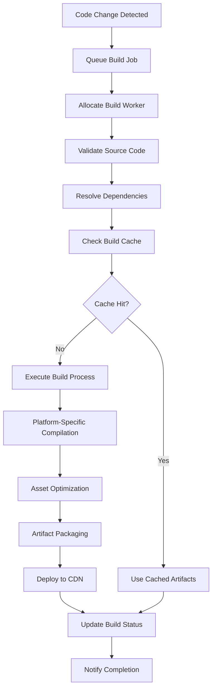
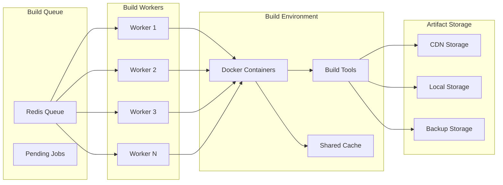
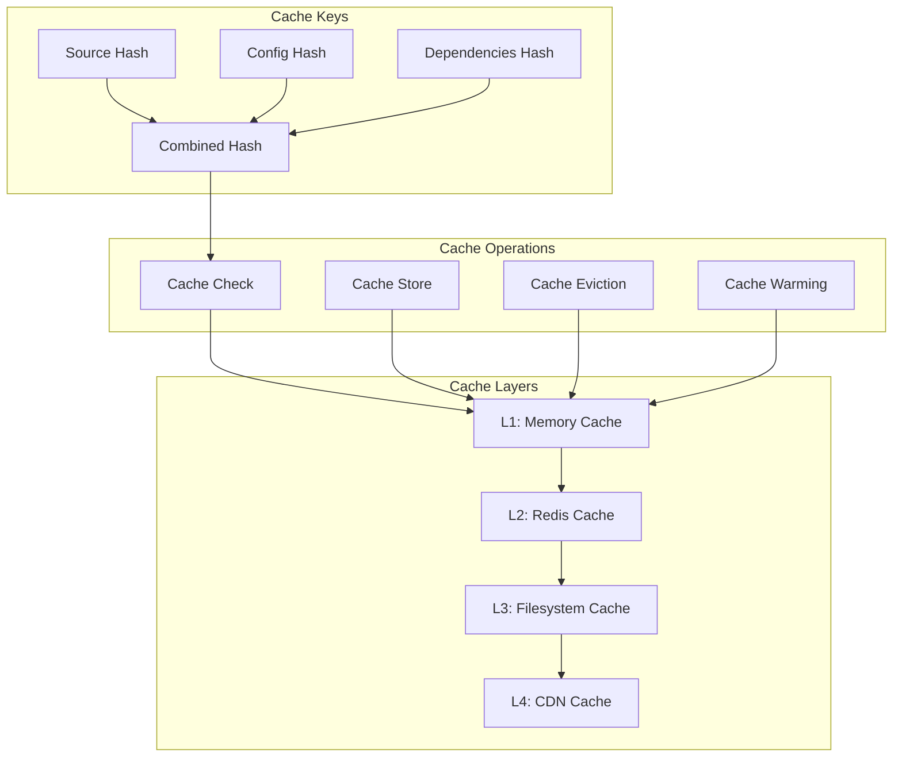

# Build Pipeline Documentation and Troubleshooting Guide

## Build Pipeline Overview

The Workz! build pipeline is a sophisticated system that automatically compiles, optimizes, and deploys applications across multiple platforms. It supports both JavaScript and Flutter applications with intelligent caching, parallel processing, and comprehensive error handling.

## Pipeline Architecture

### Build Flow



### Build Worker Architecture



## Build Configuration

### Global Build Configuration

```json
{
  "buildSystem": {
    "maxConcurrentBuilds": 10,
    "buildTimeout": 1800,
    "retryAttempts": 3,
    "cacheEnabled": true,
    "cacheTTL": 604800,
    "artifactRetention": 2592000
  },
  "platforms": {
    "javascript": {
      "enabled": true,
      "targets": ["web"],
      "nodeVersion": "18.x",
      "buildTools": ["webpack", "babel", "terser"]
    },
    "flutter": {
      "enabled": true,
      "targets": ["web", "android", "ios", "windows", "macos", "linux"],
      "flutterVersion": "3.16.x",
      "dartVersion": "3.2.x",
      "buildTools": ["flutter", "dart"]
    }
  },
  "optimization": {
    "minification": true,
    "compression": "gzip",
    "assetOptimization": true,
    "treeshaking": true,
    "sourceMaps": false
  }
}
```

### App-Specific Build Configuration

```json
{
  "name": "My Workz App",
  "version": "1.0.0",
  "appType": "flutter",
  "buildTargets": ["web", "android", "ios"],
  "buildConfig": {
    "optimization": {
      "minify": true,
      "obfuscate": false,
      "sourceMaps": false
    },
    "flutter": {
      "webRenderer": "canvaskit",
      "targetPlatform": "web-javascript",
      "buildMode": "release"
    },
    "javascript": {
      "target": "es2020",
      "moduleFormat": "esm",
      "bundler": "webpack"
    },
    "assets": {
      "optimize": true,
      "formats": ["webp", "avif"],
      "compression": "auto"
    }
  },
  "dependencies": {
    "workzSDK": "^2.0.0"
  },
  "hooks": {
    "preBuild": ["flutter pub get", "dart analyze"],
    "postBuild": ["flutter test", "dart doc"]
  }
}
```

## Build Process Details

### JavaScript Build Process

```php
<?php
// Detailed JavaScript build implementation
class JavaScriptBuildProcess {
    private $config;
    private $logger;
    private $cache;
    
    public function build(array $sourceCode, array $options = []): array {
        $this->logger->info('Starting JavaScript build process');
        
        $buildSteps = [
            'validate' => [$this, 'validateSource'],
            'dependencies' => [$this, 'resolveDependencies'],
            'transpile' => [$this, 'transpileCode'],
            'bundle' => [$this, 'bundleAssets'],
            'optimize' => [$this, 'optimizeOutput'],
            'package' => [$this, 'packageArtifacts']
        ];
        
        $buildContext = [
            'sourceCode' => $sourceCode,
            'options' => $options,
            'buildDir' => $this->createBuildDirectory(),
            'startTime' => microtime(true)
        ];
        
        try {
            foreach ($buildSteps as $stepName => $stepFunction) {
                $this->logger->info("Executing build step: {$stepName}");
                $stepStart = microtime(true);
                
                $buildContext = $stepFunction($buildContext);
                
                $stepDuration = microtime(true) - $stepStart;
                $this->logger->info("Step {$stepName} completed in {$stepDuration}s");
                
                // Check for cancellation
                if ($this->isBuildCancelled($buildContext['buildId'] ?? null)) {
                    throw new BuildCancelledException('Build was cancelled');
                }
            }
            
            $totalDuration = microtime(true) - $buildContext['startTime'];
            $this->logger->info("JavaScript build completed in {$totalDuration}s");
            
            return $buildContext['artifacts'];
            
        } catch (Exception $e) {
            $this->logger->error("JavaScript build failed: " . $e->getMessage());
            $this->cleanupBuildDirectory($buildContext['buildDir']);
            throw $e;
        }
    }
    
    private function validateSource(array $context): array {
        $sourceCode = $context['sourceCode'];
        $errors = [];
        
        // Check for required files
        if (!isset($sourceCode['main.js']) && !isset($sourceCode['index.js'])) {
            $errors[] = 'Missing main entry point (main.js or index.js)';
        }
        
        // Validate JavaScript syntax
        foreach ($sourceCode as $filename => $content) {
            if (pathinfo($filename, PATHINFO_EXTENSION) === 'js') {
                $syntaxCheck = $this->validateJavaScriptSyntax($content, $filename);
                if (!$syntaxCheck['valid']) {
                    $errors[] = "Syntax error in {$filename}: {$syntaxCheck['error']}";
                }
            }
        }
        
        // Check for security issues
        $securityIssues = $this->scanForSecurityIssues($sourceCode);
        $errors = array_merge($errors, $securityIssues);
        
        if (!empty($errors)) {
            throw new BuildValidationException('Source validation failed: ' . implode(', ', $errors));
        }
        
        $context['validation'] = ['passed' => true, 'timestamp' => time()];
        return $context;
    }
    
    private function resolveDependencies(array $context): array {
        $sourceCode = $context['sourceCode'];
        $packageJson = json_decode($sourceCode['package.json'] ?? '{}', true);
        
        $dependencies = $packageJson['dependencies'] ?? [];
        $devDependencies = $packageJson['devDependencies'] ?? [];
        
        // Add Workz SDK if not present
        if (!isset($dependencies['workz-sdk'])) {
            $dependencies['workz-sdk'] = '^2.0.0';
        }
        
        // Install dependencies
        $this->installDependencies($context['buildDir'], $dependencies, $devDependencies);
        
        // Verify dependency integrity
        $this->verifyDependencyIntegrity($context['buildDir']);
        
        $context['dependencies'] = [
            'production' => $dependencies,
            'development' => $devDependencies,
            'resolved' => $this->getResolvedDependencies($context['buildDir'])
        ];
        
        return $context;
    }
    
    private function transpileCode(array $context): array {
        $sourceCode = $context['sourceCode'];
        $buildDir = $context['buildDir'];
        
        // Configure Babel for transpilation
        $babelConfig = [
            'presets' => [
                ['@babel/preset-env', [
                    'targets' => '> 0.25%, not dead',
                    'useBuiltIns' => 'usage',
                    'corejs' => 3
                ]]
            ],
            'plugins' => [
                '@babel/plugin-proposal-class-properties',
                '@babel/plugin-proposal-optional-chaining'
            ]
        ];
        
        $transpiledCode = [];
        
        foreach ($sourceCode as $filename => $content) {
            if (pathinfo($filename, PATHINFO_EXTENSION) === 'js') {
                $transpiled = $this->babelTranspile($content, $babelConfig);
                $transpiledCode[$filename] = $transpiled;
                
                // Write to build directory
                $outputPath = $buildDir . '/src/' . $filename;
                $this->ensureDirectoryExists(dirname($outputPath));
                file_put_contents($outputPath, $transpiled);
            } else {
                // Copy non-JS files as-is
                $outputPath = $buildDir . '/src/' . $filename;
                $this->ensureDirectoryExists(dirname($outputPath));
                file_put_contents($outputPath, $content);
            }
        }
        
        $context['transpiledCode'] = $transpiledCode;
        return $context;
    }
    
    private function bundleAssets(array $context): array {
        $buildDir = $context['buildDir'];
        $options = $context['options'];
        
        // Configure Webpack
        $webpackConfig = [
            'mode' => $options['mode'] ?? 'production',
            'entry' => $buildDir . '/src/main.js',
            'output' => [
                'path' => $buildDir . '/dist',
                'filename' => 'bundle.js',
                'publicPath' => '/'
            ],
            'module' => [
                'rules' => [
                    [
                        'test' => '/\.js$/',
                        'exclude' => '/node_modules/',
                        'use' => 'babel-loader'
                    ],
                    [
                        'test' => '/\.css$/',
                        'use' => ['style-loader', 'css-loader']
                    ],
                    [
                        'test' => '/\.(png|jpg|gif|svg)$/',
                        'type' => 'asset/resource'
                    ]
                ]
            ],
            'plugins' => [
                'HtmlWebpackPlugin' => [
                    'template' => $buildDir . '/src/index.html',
                    'inject' => true
                ]
            ]
        ];
        
        // Execute Webpack build
        $webpackResult = $this->executeWebpack($webpackConfig);
        
        if (!$webpackResult['success']) {
            throw new BuildException('Webpack bundling failed: ' . $webpackResult['error']);
        }
        
        $context['bundleResult'] = $webpackResult;
        return $context;
    }
    
    private function optimizeOutput(array $context): array {
        $buildDir = $context['buildDir'];
        $options = $context['options'];
        
        $optimizations = [];
        
        // Minify JavaScript
        if ($options['minify'] ?? true) {
            $jsFiles = glob($buildDir . '/dist/*.js');
            foreach ($jsFiles as $jsFile) {
                $minified = $this->minifyJavaScript(file_get_contents($jsFile));
                file_put_contents($jsFile, $minified);
                $optimizations['minified_js'][] = basename($jsFile);
            }
        }
        
        // Optimize CSS
        $cssFiles = glob($buildDir . '/dist/*.css');
        foreach ($cssFiles as $cssFile) {
            $optimized = $this->optimizeCSS(file_get_contents($cssFile));
            file_put_contents($cssFile, $optimized);
            $optimizations['optimized_css'][] = basename($cssFile);
        }
        
        // Optimize images
        $imageFiles = glob($buildDir . '/dist/**/*.{jpg,jpeg,png,gif,svg}', GLOB_BRACE);
        foreach ($imageFiles as $imageFile) {
            $this->optimizeImage($imageFile);
            $optimizations['optimized_images'][] = basename($imageFile);
        }
        
        // Generate service worker for caching
        if ($options['generateSW'] ?? true) {
            $this->generateServiceWorker($buildDir . '/dist');
            $optimizations['service_worker'] = true;
        }
        
        $context['optimizations'] = $optimizations;
        return $context;
    }
    
    private function packageArtifacts(array $context): array {
        $buildDir = $context['buildDir'];
        $distDir = $buildDir . '/dist';
        
        // Calculate build size
        $buildSize = $this->calculateDirectorySize($distDir);
        
        // Generate manifest
        $manifest = [
            'name' => $context['options']['appName'] ?? 'Workz App',
            'version' => $context['options']['version'] ?? '1.0.0',
            'buildTime' => date('c'),
            'buildSize' => $buildSize,
            'files' => $this->getFileList($distDir),
            'entryPoint' => 'index.html',
            'type' => 'javascript-web'
        ];
        
        file_put_contents($distDir . '/manifest.json', json_encode($manifest, JSON_PRETTY_PRINT));
        
        $context['artifacts'] = [
            'type' => 'web',
            'path' => $distDir,
            'size' => $buildSize,
            'manifest' => $manifest,
            'entryPoint' => 'index.html'
        ];
        
        return $context;
    }
}
```

### Flutter Build Process

```php
<?php
// Detailed Flutter build implementation
class FlutterBuildProcess {
    private $flutterPath;
    private $dartPath;
    private $logger;
    private $cache;
    
    public function build(array $sourceCode, string $target, array $options = []): array {
        $this->logger->info("Starting Flutter build for target: {$target}");
        
        $buildMethods = [
            'web' => [$this, 'buildWeb'],
            'android' => [$this, 'buildAndroid'],
            'ios' => [$this, 'buildIOS'],
            'windows' => [$this, 'buildWindows'],
            'macos' => [$this, 'buildMacOS'],
            'linux' => [$this, 'buildLinux']
        ];
        
        if (!isset($buildMethods[$target])) {
            throw new UnsupportedTargetException("Unsupported Flutter target: {$target}");
        }
        
        $projectDir = $this->createFlutterProject($sourceCode, $options);
        
        try {
            $buildMethod = $buildMethods[$target];
            $result = $buildMethod($projectDir, $options);
            
            $this->logger->info("Flutter {$target} build completed successfully");
            return $result;
            
        } finally {
            if (!($options['keepProject'] ?? false)) {
                $this->cleanupProjectDirectory($projectDir);
            }
        }
    }
    
    private function buildWeb(string $projectDir, array $options): array {
        $this->logger->info('Building Flutter web application');
        
        // Configure web build
        $webConfig = [
            'renderer' => $options['webRenderer'] ?? 'canvaskit',
            'buildMode' => $options['buildMode'] ?? 'release',
            'sourceMaps' => $options['sourceMaps'] ?? false,
            'treeShakeIcons' => $options['treeShakeIcons'] ?? true
        ];
        
        // Prepare build command
        $buildCommand = [
            $this->flutterPath,
            'build',
            'web',
            '--' . $webConfig['buildMode']
        ];
        
        if ($webConfig['renderer'] === 'html') {
            $buildCommand[] = '--web-renderer=html';
        } else {
            $buildCommand[] = '--web-renderer=canvaskit';
        }
        
        if ($webConfig['sourceMaps']) {
            $buildCommand[] = '--source-maps';
        }
        
        if ($webConfig['treeShakeIcons']) {
            $buildCommand[] = '--tree-shake-icons';
        }
        
        // Execute build
        $result = $this->executeCommand(implode(' ', $buildCommand), $projectDir);
        
        if ($result['exitCode'] !== 0) {
            throw new FlutterBuildException('Flutter web build failed: ' . $result['stderr']);
        }
        
        // Post-process web build
        $webBuildDir = $projectDir . '/build/web';
        $this->postProcessWebBuild($webBuildDir, $options);
        
        return [
            'type' => 'web',
            'path' => $webBuildDir,
            'size' => $this->calculateDirectorySize($webBuildDir),
            'entryPoint' => 'index.html',
            'renderer' => $webConfig['renderer'],
            'buildMode' => $webConfig['buildMode']
        ];
    }
    
    private function buildAndroid(string $projectDir, array $options): array {
        $this->logger->info('Building Flutter Android application');
        
        // Configure Android build
        $androidConfig = [
            'buildType' => $options['buildType'] ?? 'release',
            'targetAbi' => $options['targetAbi'] ?? 'arm64-v8a,armeabi-v7a,x86_64',
            'obfuscate' => $options['obfuscate'] ?? true,
            'splitPerAbi' => $options['splitPerAbi'] ?? false
        ];
        
        // Prepare build command
        $buildCommand = [
            $this->flutterPath,
            'build',
            'apk',
            '--' . $androidConfig['buildType']
        ];
        
        if ($androidConfig['obfuscate'] && $androidConfig['buildType'] === 'release') {
            $buildCommand[] = '--obfuscate';
            $buildCommand[] = '--split-debug-info=build/debug-info';
        }
        
        if ($androidConfig['splitPerAbi']) {
            $buildCommand[] = '--split-per-abi';
        }
        
        $buildCommand[] = '--target-platform=' . $androidConfig['targetAbi'];
        
        // Execute build
        $result = $this->executeCommand(implode(' ', $buildCommand), $projectDir);
        
        if ($result['exitCode'] !== 0) {
            throw new FlutterBuildException('Flutter Android build failed: ' . $result['stderr']);
        }
        
        // Locate APK files
        $apkDir = $projectDir . '/build/app/outputs/flutter-apk';
        $apkFiles = glob($apkDir . '/*.apk');
        
        if (empty($apkFiles)) {
            throw new FlutterBuildException('No APK files found after build');
        }
        
        $artifacts = [];
        foreach ($apkFiles as $apkFile) {
            $artifacts[] = [
                'file' => basename($apkFile),
                'path' => $apkFile,
                'size' => filesize($apkFile),
                'type' => 'apk'
            ];
        }
        
        return [
            'type' => 'android',
            'artifacts' => $artifacts,
            'buildType' => $androidConfig['buildType'],
            'totalSize' => array_sum(array_column($artifacts, 'size'))
        ];
    }
    
    private function buildIOS(string $projectDir, array $options): array {
        $this->logger->info('Building Flutter iOS application');
        
        // Check if running on macOS
        if (PHP_OS !== 'Darwin') {
            throw new PlatformException('iOS builds require macOS');
        }
        
        // Configure iOS build
        $iosConfig = [
            'buildMode' => $options['buildMode'] ?? 'release',
            'codesign' => $options['codesign'] ?? false,
            'exportMethod' => $options['exportMethod'] ?? 'development'
        ];
        
        // Prepare build command
        $buildCommand = [
            $this->flutterPath,
            'build',
            'ios',
            '--' . $iosConfig['buildMode']
        ];
        
        if (!$iosConfig['codesign']) {
            $buildCommand[] = '--no-codesign';
        }
        
        // Execute build
        $result = $this->executeCommand(implode(' ', $buildCommand), $projectDir);
        
        if ($result['exitCode'] !== 0) {
            throw new FlutterBuildException('Flutter iOS build failed: ' . $result['stderr']);
        }
        
        // Create IPA if codesigning is enabled
        $appPath = $projectDir . '/build/ios/iphoneos/Runner.app';
        $ipaPath = null;
        
        if ($iosConfig['codesign']) {
            $ipaPath = $this->createIPA($appPath, $iosConfig['exportMethod']);
        }
        
        return [
            'type' => 'ios',
            'appPath' => $appPath,
            'ipaPath' => $ipaPath,
            'buildMode' => $iosConfig['buildMode'],
            'codesigned' => $iosConfig['codesign'],
            'size' => $this->calculateDirectorySize($appPath)
        ];
    }
    
    private function postProcessWebBuild(string $webBuildDir, array $options): void {
        // Inject Workz SDK integration
        $indexPath = $webBuildDir . '/index.html';
        $indexContent = file_get_contents($indexPath);
        
        // Add Workz SDK script
        $sdkScript = '<script src="/js/core/workz-sdk-v2.js"></script>';
        $indexContent = str_replace('</head>', $sdkScript . "\n</head>", $indexContent);
        
        // Add Workz initialization
        $initScript = $this->generateWorkzInitScript($options);
        $indexContent = str_replace('</body>', $initScript . "\n</body>", $indexContent);
        
        file_put_contents($indexPath, $indexContent);
        
        // Optimize assets
        if ($options['optimizeAssets'] ?? true) {
            $this->optimizeWebAssets($webBuildDir);
        }
        
        // Generate PWA manifest if requested
        if ($options['generatePWA'] ?? false) {
            $this->generatePWAManifest($webBuildDir, $options);
        }
    }
    
    private function createFlutterProject(array $sourceCode, array $options): string {
        $projectDir = sys_get_temp_dir() . '/flutter_build_' . uniqid();
        
        // Create project structure
        $this->createProjectStructure($projectDir);
        
        // Write source files
        foreach ($sourceCode as $relativePath => $content) {
            $fullPath = $projectDir . '/' . $relativePath;
            $this->ensureDirectoryExists(dirname($fullPath));
            file_put_contents($fullPath, $content);
        }
        
        // Generate missing configuration files
        $this->generateMissingConfigFiles($projectDir, $sourceCode, $options);
        
        // Run flutter pub get
        $pubGetResult = $this->executeCommand($this->flutterPath . ' pub get', $projectDir);
        
        if ($pubGetResult['exitCode'] !== 0) {
            throw new FlutterBuildException('Flutter pub get failed: ' . $pubGetResult['stderr']);
        }
        
        return $projectDir;
    }
}
```

## Build Caching System

### Cache Architecture



### Cache Implementation

```php
<?php
// Advanced build caching system
class BuildCache {
    private $memoryCache;
    private $redisCache;
    private $filesystemCache;
    private $config;
    
    public function __construct(array $config) {
        $this->config = $config;
        $this->memoryCache = new MemoryCache($config['memory']);
        $this->redisCache = new RedisCache($config['redis']);
        $this->filesystemCache = new FilesystemCache($config['filesystem']);
    }
    
    public function get(string $cacheKey): ?array {
        // Try L1 cache (memory) first
        $result = $this->memoryCache->get($cacheKey);
        if ($result !== null) {
            $this->recordCacheHit('memory', $cacheKey);
            return $result;
        }
        
        // Try L2 cache (Redis)
        $result = $this->redisCache->get($cacheKey);
        if ($result !== null) {
            // Promote to L1 cache
            $this->memoryCache->set($cacheKey, $result, 300); // 5 minutes
            $this->recordCacheHit('redis', $cacheKey);
            return $result;
        }
        
        // Try L3 cache (filesystem)
        $result = $this->filesystemCache->get($cacheKey);
        if ($result !== null) {
            // Promote to L2 and L1 caches
            $this->redisCache->set($cacheKey, $result, 3600); // 1 hour
            $this->memoryCache->set($cacheKey, $result, 300); // 5 minutes
            $this->recordCacheHit('filesystem', $cacheKey);
            return $result;
        }
        
        $this->recordCacheMiss($cacheKey);
        return null;
    }
    
    public function set(string $cacheKey, array $data, int $ttl = null): void {
        $ttl = $ttl ?? $this->config['default_ttl'];
        
        // Store in all cache layers
        $this->memoryCache->set($cacheKey, $data, min($ttl, 300));
        $this->redisCache->set($cacheKey, $data, min($ttl, 3600));
        $this->filesystemCache->set($cacheKey, $data, $ttl);
        
        $this->recordCacheStore($cacheKey, $data);
    }
    
    public function generateCacheKey(array $buildContext): string {
        $keyComponents = [
            'source_hash' => $this->hashSourceCode($buildContext['sourceCode']),
            'config_hash' => $this->hashBuildConfig($buildContext['options']),
            'deps_hash' => $this->hashDependencies($buildContext['dependencies'] ?? []),
            'platform' => $buildContext['target'] ?? 'web',
            'sdk_version' => $this->getSDKVersion()
        ];
        
        return 'build:' . md5(json_encode($keyComponents));
    }
    
    private function hashSourceCode(array $sourceCode): string {
        // Create deterministic hash of source code
        ksort($sourceCode);
        $content = '';
        
        foreach ($sourceCode as $filename => $code) {
            $content .= $filename . ':' . md5($code) . ';';
        }
        
        return md5($content);
    }
    
    private function hashBuildConfig(array $config): string {
        // Normalize and hash build configuration
        $normalizedConfig = $this->normalizeBuildConfig($config);
        return md5(json_encode($normalizedConfig));
    }
    
    private function hashDependencies(array $dependencies): string {
        // Hash resolved dependency versions
        ksort($dependencies);
        return md5(json_encode($dependencies));
    }
    
    public function invalidateByPattern(string $pattern): int {
        $invalidated = 0;
        
        // Invalidate from all cache layers
        $invalidated += $this->memoryCache->invalidateByPattern($pattern);
        $invalidated += $this->redisCache->invalidateByPattern($pattern);
        $invalidated += $this->filesystemCache->invalidateByPattern($pattern);
        
        return $invalidated;
    }
    
    public function warmCache(array $popularApps): void {
        foreach ($popularApps as $appId) {
            $this->warmAppCache($appId);
        }
    }
    
    private function warmAppCache(string $appId): void {
        try {
            // Pre-build popular apps during low-traffic periods
            $app = $this->getApp($appId);
            $sourceCode = $this->getSourceCode($app);
            
            $cacheKey = $this->generateCacheKey([
                'sourceCode' => $sourceCode,
                'options' => $app['build_config'] ?? [],
                'target' => 'web'
            ]);
            
            // Check if already cached
            if ($this->get($cacheKey) === null) {
                // Trigger background build
                $this->queueBackgroundBuild($appId, ['cache_warming' => true]);
            }
            
        } catch (Exception $e) {
            $this->logger->warning("Cache warming failed for app {$appId}: " . $e->getMessage());
        }
    }
}
```

## Troubleshooting Guide

### Common Build Failures

#### 1. Dependency Resolution Failures

**Symptoms**:
- Build fails during dependency installation
- "Package not found" errors
- Version conflict errors

**Diagnosis**:
```bash
# Check package.json/pubspec.yaml syntax
cat package.json | jq .  # For JavaScript
flutter pub deps  # For Flutter

# Check dependency registry connectivity
npm ping  # For npm
pub deps --dry-run  # For Dart packages

# Verify dependency versions
npm ls  # For JavaScript
flutter pub deps  # For Flutter
```

**Solutions**:
```bash
# Clear dependency cache
npm cache clean --force  # JavaScript
flutter pub cache repair  # Flutter

# Update dependency versions
npm update  # JavaScript
flutter pub upgrade  # Flutter

# Fix version conflicts
npm install --legacy-peer-deps  # JavaScript
# Edit pubspec.yaml to resolve conflicts  # Flutter
```

#### 2. Build Timeout Issues

**Symptoms**:
- Builds fail with timeout errors
- Long-running builds that never complete
- Resource exhaustion errors

**Diagnosis**:
```bash
# Check build worker resources
top -p $(pgrep -f "flutter build")
ps aux | grep "node.*webpack"

# Monitor disk space
df -h /tmp
df -h /var/lib/docker

# Check memory usage
free -h
cat /proc/meminfo
```

**Solutions**:
```php
<?php
// Implement build timeout handling
class BuildTimeoutHandler {
    private $maxBuildTime;
    private $warningTime;
    
    public function __construct(int $maxBuildTime = 1800, int $warningTime = 1200) {
        $this->maxBuildTime = $maxBuildTime;
        $this->warningTime = $warningTime;
    }
    
    public function monitorBuild(string $buildId, callable $buildProcess): array {
        $startTime = time();
        $warningIssued = false;
        
        // Set up timeout handler
        pcntl_signal(SIGALRM, function() use ($buildId) {
            $this->handleBuildTimeout($buildId);
        });
        
        pcntl_alarm($this->maxBuildTime);
        
        try {
            // Monitor build progress
            while (true) {
                $currentTime = time();
                $elapsed = $currentTime - $startTime;
                
                // Issue warning if approaching timeout
                if (!$warningIssued && $elapsed > $this->warningTime) {
                    $this->issueBuildWarning($buildId, $elapsed);
                    $warningIssued = true;
                }
                
                // Check if build completed
                $status = $this->getBuildStatus($buildId);
                if (in_array($status, ['completed', 'failed', 'cancelled'])) {
                    pcntl_alarm(0); // Cancel timeout
                    return ['status' => $status, 'elapsed' => $elapsed];
                }
                
                sleep(5); // Check every 5 seconds
            }
            
        } catch (BuildTimeoutException $e) {
            return ['status' => 'timeout', 'elapsed' => $elapsed];
        }
    }
    
    private function handleBuildTimeout(string $buildId): void {
        // Kill build process
        $this->killBuildProcess($buildId);
        
        // Update build status
        $this->updateBuildStatus($buildId, 'timeout');
        
        // Clean up resources
        $this->cleanupBuildResources($buildId);
        
        throw new BuildTimeoutException("Build {$buildId} timed out");
    }
}
```

#### 3. Platform-Specific Build Issues

**Flutter Web Build Issues**:
```bash
# Common Flutter web issues and solutions

# Issue: CanvasKit loading failures
# Solution: Switch to HTML renderer
flutter build web --web-renderer html

# Issue: Large bundle size
# Solution: Enable tree shaking and optimization
flutter build web --tree-shake-icons --dart-define=flutter.web.canvaskit.url=https://unpkg.com/canvaskit-wasm@0.33.0/bin/

# Issue: CORS errors in development
# Solution: Configure web server properly
flutter run -d chrome --web-port 8080 --web-hostname localhost
```

**Flutter Mobile Build Issues**:
```bash
# Android build issues
# Issue: Gradle build failures
./gradlew clean  # In android directory
flutter clean
flutter pub get

# Issue: SDK version conflicts
# Edit android/app/build.gradle
# Set compileSdkVersion and targetSdkVersion appropriately

# iOS build issues (macOS only)
# Issue: Xcode version compatibility
sudo xcode-select --switch /Applications/Xcode.app/Contents/Developer
flutter doctor --verbose

# Issue: Provisioning profile errors
# Open ios/Runner.xcworkspace in Xcode
# Configure signing and capabilities
```

**JavaScript Build Issues**:
```bash
# Webpack build failures
# Issue: Memory heap errors
export NODE_OPTIONS="--max-old-space-size=4096"
npm run build

# Issue: Module resolution errors
# Check webpack.config.js resolve configuration
# Verify file paths and extensions

# Issue: Babel transpilation errors
# Update .babelrc or babel.config.js
# Check preset and plugin compatibility
```

### Performance Optimization

#### Build Performance Monitoring

```php
<?php
// Build performance monitoring and optimization
class BuildPerformanceMonitor {
    private $metrics;
    private $thresholds;
    
    public function __construct() {
        $this->thresholds = [
            'javascript_web' => 120, // 2 minutes
            'flutter_web' => 300,    // 5 minutes
            'flutter_android' => 600, // 10 minutes
            'flutter_ios' => 900     // 15 minutes
        ];
    }
    
    public function monitorBuild(string $buildId, string $appType, string $target): void {
        $startTime = microtime(true);
        $buildKey = $appType . '_' . $target;
        $threshold = $this->thresholds[$buildKey] ?? 300;
        
        // Monitor build stages
        $stages = [
            'validation' => 0,
            'dependencies' => 0,
            'compilation' => 0,
            'optimization' => 0,
            'packaging' => 0
        ];
        
        $currentStage = 'validation';
        $stageStartTime = $startTime;
        
        // Register stage change callback
        $this->onStageChange(function($newStage) use (&$currentStage, &$stageStartTime, &$stages) {
            $stageEndTime = microtime(true);
            $stages[$currentStage] = $stageEndTime - $stageStartTime;
            
            $currentStage = $newStage;
            $stageStartTime = $stageEndTime;
        });
        
        // Monitor completion
        $this->onBuildComplete(function($status) use ($buildId, $buildKey, $startTime, $stages, $threshold) {
            $totalTime = microtime(true) - $startTime;
            
            // Record metrics
            $this->metrics->record('build_duration', $totalTime, [
                'build_id' => $buildId,
                'build_type' => $buildKey,
                'status' => $status
            ]);
            
            foreach ($stages as $stage => $duration) {
                $this->metrics->record('build_stage_duration', $duration, [
                    'build_id' => $buildId,
                    'build_type' => $buildKey,
                    'stage' => $stage
                ]);
            }
            
            // Alert if build is slow
            if ($totalTime > $threshold) {
                $this->alertSlowBuild($buildId, $buildKey, $totalTime, $stages);
            }
            
            // Suggest optimizations
            $this->suggestOptimizations($buildKey, $stages);
        });
    }
    
    private function suggestOptimizations(string $buildType, array $stages): array {
        $suggestions = [];
        
        // Analyze stage durations
        $totalTime = array_sum($stages);
        
        foreach ($stages as $stage => $duration) {
            $percentage = ($duration / $totalTime) * 100;
            
            if ($percentage > 40) { // Stage takes more than 40% of total time
                switch ($stage) {
                    case 'dependencies':
                        $suggestions[] = [
                            'stage' => $stage,
                            'issue' => 'Slow dependency resolution',
                            'solutions' => [
                                'Enable dependency caching',
                                'Use local package mirror',
                                'Optimize dependency versions'
                            ]
                        ];
                        break;
                        
                    case 'compilation':
                        $suggestions[] = [
                            'stage' => $stage,
                            'issue' => 'Slow compilation',
                            'solutions' => [
                                'Enable incremental compilation',
                                'Use faster build tools',
                                'Optimize source code structure'
                            ]
                        ];
                        break;
                        
                    case 'optimization':
                        $suggestions[] = [
                            'stage' => $stage,
                            'issue' => 'Slow optimization',
                            'solutions' => [
                                'Reduce optimization level for development builds',
                                'Use parallel optimization',
                                'Cache optimization results'
                            ]
                        ];
                        break;
                }
            }
        }
        
        return $suggestions;
    }
}
```

#### Build Queue Optimization

```php
<?php
// Intelligent build queue management
class BuildQueueOptimizer {
    private $queue;
    private $workers;
    private $priorityCalculator;
    
    public function optimizeQueue(): void {
        $pendingBuilds = $this->queue->getPendingBuilds();
        
        // Sort builds by priority
        usort($pendingBuilds, function($a, $b) {
            return $this->priorityCalculator->compare($a, $b);
        });
        
        // Assign builds to optimal workers
        foreach ($pendingBuilds as $build) {
            $optimalWorker = $this->findOptimalWorker($build);
            if ($optimalWorker) {
                $this->assignBuildToWorker($build, $optimalWorker);
            }
        }
        
        // Scale workers if needed
        $this->autoScaleWorkers($pendingBuilds);
    }
    
    private function findOptimalWorker(array $build): ?string {
        $availableWorkers = $this->workers->getAvailable();
        
        if (empty($availableWorkers)) {
            return null;
        }
        
        // Score workers based on suitability
        $scores = [];
        
        foreach ($availableWorkers as $worker) {
            $score = 0;
            
            // Prefer workers with cached dependencies
            if ($this->workerHasCachedDeps($worker, $build)) {
                $score += 50;
            }
            
            // Prefer workers with matching platform tools
            if ($this->workerHasPlatformTools($worker, $build['target'])) {
                $score += 30;
            }
            
            // Consider worker load
            $load = $this->workers->getLoad($worker);
            $score += (100 - $load); // Lower load = higher score
            
            // Consider worker performance history
            $performance = $this->workers->getPerformanceScore($worker);
            $score += $performance;
            
            $scores[$worker] = $score;
        }
        
        // Return worker with highest score
        arsort($scores);
        return array_key_first($scores);
    }
    
    private function autoScaleWorkers(array $pendingBuilds): void {
        $queueLength = count($pendingBuilds);
        $activeWorkers = $this->workers->getActiveCount();
        $maxWorkers = $this->config['max_workers'];
        
        // Scale up if queue is long
        if ($queueLength > $activeWorkers * 2 && $activeWorkers < $maxWorkers) {
            $newWorkers = min($queueLength - $activeWorkers, $maxWorkers - $activeWorkers);
            $this->workers->scaleUp($newWorkers);
        }
        
        // Scale down if queue is empty
        if ($queueLength === 0 && $activeWorkers > $this->config['min_workers']) {
            $this->workers->scaleDown(1);
        }
    }
}
```

### Monitoring and Alerting

#### Build Metrics Dashboard

```javascript
// Real-time build monitoring dashboard
class BuildMonitoringDashboard {
    constructor(apiUrl, wsUrl) {
        this.apiUrl = apiUrl;
        this.wsUrl = wsUrl;
        this.metrics = new Map();
        this.charts = new Map();
        
        this.initializeWebSocket();
        this.initializeCharts();
    }
    
    initializeWebSocket() {
        this.ws = new WebSocket(this.wsUrl);
        
        this.ws.onmessage = (event) => {
            const data = JSON.parse(event.data);
            this.handleMetricUpdate(data);
        };
        
        this.ws.onclose = () => {
            // Reconnect after 5 seconds
            setTimeout(() => this.initializeWebSocket(), 5000);
        };
    }
    
    initializeCharts() {
        // Build duration chart
        this.charts.set('buildDuration', new Chart('buildDurationChart', {
            type: 'line',
            data: {
                labels: [],
                datasets: [{
                    label: 'Build Duration (seconds)',
                    data: [],
                    borderColor: 'rgb(75, 192, 192)',
                    tension: 0.1
                }]
            },
            options: {
                responsive: true,
                scales: {
                    y: {
                        beginAtZero: true
                    }
                }
            }
        }));
        
        // Build success rate chart
        this.charts.set('successRate', new Chart('successRateChart', {
            type: 'doughnut',
            data: {
                labels: ['Success', 'Failed', 'Timeout'],
                datasets: [{
                    data: [0, 0, 0],
                    backgroundColor: ['#4CAF50', '#F44336', '#FF9800']
                }]
            }
        }));
        
        // Queue length chart
        this.charts.set('queueLength', new Chart('queueLengthChart', {
            type: 'bar',
            data: {
                labels: ['Pending', 'Building', 'Completed'],
                datasets: [{
                    label: 'Build Count',
                    data: [0, 0, 0],
                    backgroundColor: ['#2196F3', '#FF9800', '#4CAF50']
                }]
            }
        }));
    }
    
    handleMetricUpdate(data) {
        switch (data.type) {
            case 'build_completed':
                this.updateBuildDuration(data);
                this.updateSuccessRate(data);
                break;
                
            case 'queue_status':
                this.updateQueueLength(data);
                break;
                
            case 'worker_status':
                this.updateWorkerStatus(data);
                break;
        }
    }
    
    updateBuildDuration(data) {
        const chart = this.charts.get('buildDuration');
        const now = new Date().toLocaleTimeString();
        
        chart.data.labels.push(now);
        chart.data.datasets[0].data.push(data.duration);
        
        // Keep only last 20 data points
        if (chart.data.labels.length > 20) {
            chart.data.labels.shift();
            chart.data.datasets[0].data.shift();
        }
        
        chart.update();
    }
    
    updateSuccessRate(data) {
        const chart = this.charts.get('successRate');
        const status = data.status;
        
        if (status === 'success') {
            chart.data.datasets[0].data[0]++;
        } else if (status === 'failed') {
            chart.data.datasets[0].data[1]++;
        } else if (status === 'timeout') {
            chart.data.datasets[0].data[2]++;
        }
        
        chart.update();
    }
    
    updateQueueLength(data) {
        const chart = this.charts.get('queueLength');
        
        chart.data.datasets[0].data = [
            data.pending,
            data.building,
            data.completed
        ];
        
        chart.update();
    }
    
    async loadHistoricalData() {
        try {
            const response = await fetch(`${this.apiUrl}/build-metrics/historical`);
            const data = await response.json();
            
            // Populate charts with historical data
            this.populateHistoricalCharts(data);
            
        } catch (error) {
            console.error('Failed to load historical data:', error);
        }
    }
    
    displayAlerts() {
        const alertContainer = document.getElementById('alerts');
        
        // Check for performance issues
        const avgDuration = this.calculateAverageDuration();
        if (avgDuration > 300) { // 5 minutes
            this.showAlert('warning', `Average build duration is high: ${avgDuration}s`);
        }
        
        // Check for high failure rate
        const failureRate = this.calculateFailureRate();
        if (failureRate > 0.1) { // 10%
            this.showAlert('error', `Build failure rate is high: ${(failureRate * 100).toFixed(1)}%`);
        }
        
        // Check for queue backlog
        const queueLength = this.getCurrentQueueLength();
        if (queueLength > 10) {
            this.showAlert('info', `Build queue is backed up: ${queueLength} pending builds`);
        }
    }
    
    showAlert(type, message) {
        const alertElement = document.createElement('div');
        alertElement.className = `alert alert-${type}`;
        alertElement.textContent = message;
        
        const alertContainer = document.getElementById('alerts');
        alertContainer.appendChild(alertElement);
        
        // Auto-remove after 10 seconds
        setTimeout(() => {
            alertElement.remove();
        }, 10000);
    }
}

// Initialize dashboard
const dashboard = new BuildMonitoringDashboard(
    'https://api.workz.com',
    'wss://api.workz.com/ws/build-metrics'
);

dashboard.loadHistoricalData();
setInterval(() => dashboard.displayAlerts(), 30000); // Check alerts every 30 seconds
```

This comprehensive build pipeline documentation provides detailed insights into the build process, troubleshooting common issues, and implementing performance optimizations. The monitoring and alerting systems help maintain build quality and performance over time.