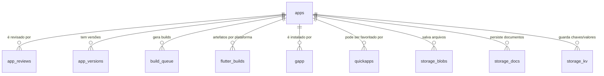

# `workz_apps` — Documentação do Esquema de Banco de Dados
> Versão: 1.0  
> Última atualização: (gerado automaticamente)

Esta documentação descreve as tabelas do schema **`workz_apps`** e seu papel no ecossistema Workz! (loja/execução de aplicativos, revisão, versionamento, fila de build, instalações e armazenamento de dados dos apps).  
Ela foi produzida a partir das estruturas exibidas nas capturas de tela fornecidas.

---

## Visão Geral (conceitual)

**Domínios principais**
- **Catálogo de Apps**: metadados e código-fonte JS (ou especificações para Flutter), revisão editorial e versionamento.
- **Ciclo de Build** (Flutter / multiplataforma): fila, artefatos por plataforma e URLs de distribuição.
- **Instalações & Favoritos**: relação usuário/entidade ↔ app, status de assinatura e atalhos rápidos.
- **Storage por App**: blobs (arquivos binários), documentos (JSON com tipagem lógica) e KV (pares chave‑valor), todos com _scoping_ por **user**, **business** ou **team**.

**Tabelas**
- [`apps`](#apps) — catálogo de aplicativos, código JS/Flutter, metadados e status de build.
- [`app_reviews`](#app_reviews) — ciclo de revisão editorial/curadoria dos apps.
- [`app_versions`](#app_versions) — histórico de versões e changelogs (principalmente para apps JS).
- [`build_queue`](#build_queue) — fila de builds (sobretudo Flutter) e logs do processo.
- [`flutter_builds`](#flutter_builds) — artefatos gerados por plataforma, com URLs de download/loja.
- [`gapp`](#gapp) — instalações/assinaturas de apps (por usuário/entidade) e estado.
- [`quickapps`](#quickapps) — lista de apps favoritos (acesso rápido) por usuário.
- [`storage_blobs`](#storage_blobs) — arquivos binários por app/escopo (ex.: uploads).
- [`storage_docs`](#storage_docs) — documentos JSON versionados por app/escopo.
- [`storage_kv`](#storage_kv) — armazenamento chave‑valor por app/escopo (com TTL opcional).

---

## Convenções, tipos e termos

- `id` inteiro auto‑incremento (chave primária) ou `bigint` para volumes maiores.
- Colunas `created_at` e `updated_at` usam `CURRENT_TIMESTAMP` e `ON UPDATE CURRENT_TIMESTAMP` quando aplicável.
- **Escopo (`scope_type`, `scope_id`)**:
  - `scope_type` ∈ {`user`, `business`, `team`}; `scope_id` contém o id da entidade correspondente.
- **Status**: campos `status` utilizam `ENUM` com valores claros (listados por tabela).
- `blob_id` / `doc_id`: identificadores externos (ex.: ULID/CUID) gerados pelos apps, guardados como `CHAR(26)`.

---

## Relacionamentos (Mermaid)



> **Observação**: As FKs não estão explícitas nas capturas, mas a cardinalidade funcional segue o diagrama.

---

## Tabelas

### `apps`
**Finalidade**: registro mestre do aplicativo (metadados, código JS, origem Flutter, estado de build).

| Coluna | Tipo | Nulo | Padrão | Descrição |
|---|---|---:|---|---|
| `id` | `int` UNSIGNED AI | Não | — | Identificador do app. |
| `slug` | `varchar(60)` | Sim | `NULL` | Slug único amigável. |
| `t` | `varchar(150)` | Não | — | Título do app. |
| `ds` | `text` | Sim | `NULL` | Descrição longa/markdown. |
| `icon` | `varchar(255)` | Sim | `NULL` | Caminho/URL do ícone. |
| `color` | `varchar(16)` | Sim | `NULL` | Cor tema (ex.: `#RRGGBB`). |
| `st` | `tinyint` | Não | `1` | Status geral (ex.: ativo=1, inativo=0). |
| `vl` | `decimal(10,2)` | Não | `0.00` | Valor/Preço (se aplicável). |
| `is_default` | `tinyint` | Não | `0` | App padrão do sistema? |
| `access_level` | `tinyint` | Não | `0` | Nível de acesso mínimo requerido. |
| `entity_type` | `tinyint` | Não | `0` | Público‑alvo principal (ex.: 0=geral, 1=apenas business). |
| `exclusive_to_entity_id` | `int` UNSIGNED | Sim | `NULL` | Restrito a uma entidade específica (se configurado). |
| `scopes` | `json` | Não | `NULL` | Lista de escopos suportados/permitidos. |
| `js_code` | `mediumtext` | Não | — | Código fonte do app (modo JS/web). |
| `app_type` | `enum('javascript','flutter')` | Sim | `javascript` | Tipo do app na Workz!. |
| `dart_code` | `longtext` | Sim | `NULL` | Código/manifest Flutter (quando aplicável). |
| `source_language` | `varchar(20)` | Sim | `javascript` | Linguagem primária do app. |
| `source_code` | `longtext` | Sim | `NULL` | Código‑fonte bruto (consolidação). |
| `compiled_at` | `timestamp` | Sim | `NULL` | Data/hora da última compilação. |
| `build_status` | `enum('pending','building','success','failed')` | Não | `success` | Estado da última build/empacotamento. |
| `build_log` | `text` | Sim | `NULL` | Log textual da última build. |
| `js_version` | `varchar(20)` | Sim | `NULL` | Versão semântica (JS). |
| `updated_at` | `datetime` | Sim | `NULL` | Atualização manual do registro. |
| `created_at` | `datetime` | Não | `CURRENT_TIMESTAMP` | Criação do registro. |
| `src` | `varchar(255)` | Sim | `NULL` | Origem/repositório (ex.: URL). |
| `embed_url` | `varchar(255)` | Sim | `NULL` | URL de incorporação/preview. |
| `publisher` | `varchar(120)` | Sim | `NULL` | Nome do publicador/desenvolvedor. |
| `version` | `varchar(20)` | Sim | `NULL` | Versão publicada (humana). |
| `dt` | `datetime` | Não | `CURRENT_TIMESTAMP` | Timestamp técnico (compatibilidade). |

**Observações**  
- `app_type` define o pipeline: **javascript** usa `js_code`/`app_versions`; **flutter** usa `dart_code`/`build_queue`/`flutter_builds`.
- `scopes` (JSON) pode listar permissões/escopos customizados do app.

---

### `app_reviews`
**Finalidade**: fluxo de revisão/curadoria antes da publicação.

| Coluna | Tipo | Nulo | Padrão | Descrição |
|---|---|---:|---|---|
| `id` | `int` AI | Não | — | Identificador. |
| `app_id` | `int` | Não | — | FK lógica para `apps.id`. |
| `reviewer_id` | `int` | Não | — | Usuário revisor (id do sistema). |
| `status` | `enum('pending','approved','rejected','needs_changes')` | Não | `pending` | Estado da revisão. |
| `comments` | `text` | Sim | `NULL` | Comentários do revisor. |
| `reviewed_at` | `datetime` | Não | `CURRENT_TIMESTAMP` | Data/hora da ação. |

---

### `app_versions`
**Finalidade**: histórico de versões para apps JS (artefato lógico + changelog).

| Coluna | Tipo | Nulo | Padrão | Descrição |
|---|---|---:|---|---|
| `id` | `int` AI | Não | — | Identificador. |
| `app_id` | `int` | Não | — | FK lógica para `apps.id`. |
| `version` | `varchar(20)` | Não | — | Versão (ex.: `1.2.0`). |
| `js_code` | `mediumtext` | Não | — | Snapshot do código. |
| `changelog` | `text` | Sim | `NULL` | Notas de alterações. |
| `created_by` | `int` | Não | — | Usuário autor da versão. |
| `created_at` | `datetime` | Não | `CURRENT_TIMESTAMP` | Carimbo de criação. |

---

### `build_queue`
**Finalidade**: fila de execução de builds (principalmente Flutter).

| Coluna | Tipo | Nulo | Padrão | Descrição |
|---|---|---:|---|---|
| `id` | `int` AI | Não | — | Identificador. |
| `app_id` | `int` | Não | — | FK lógica para `apps.id`. |
| `build_type` | `enum('flutter_web','flutter_android','flutter_ios','flutter_windows','flutter_macos','flutter_linux')` | Não | — | Tipo de build solicitada. |
| `status` | `enum('pending','building','success','failed')` | Sim | `pending` | Estado da fila. |
| `started_at` | `timestamp` | Sim | `NULL` | Início do processamento. |
| `completed_at` | `timestamp` | Sim | `NULL` | Término do processamento. |
| `build_log` | `text` | Sim | `NULL` | Log do job (stdout/stderr). |
| `output_path` | `varchar(255)` | Sim | `NULL` | Caminho do artefato no storage. |
| `created_at` | `timestamp` | Não | `CURRENT_TIMESTAMP` | Criação do item de fila. |
| `updated_at` | `timestamp` | Não | `CURRENT_TIMESTAMP ON UPDATE` | Atualização automática. |

---

### `flutter_builds`
**Finalidade**: catálogo de artefatos resultantes por **plataforma**.

| Coluna | Tipo | Nulo | Padrão | Descrição |
|---|---|---:|---|---|
| `id` | `int` AI | Não | — | Identificador. |
| `app_id` | `int` | Não | — | FK lógica para `apps.id`. |
| `platform` | `enum('web','android','ios','windows','macos','linux')` | Não | — | Plataforma alvo. |
| `build_version` | `varchar(20)` | Não | — | Versão do build (ex.: semver/CI). |
| `file_path` | `varchar(500)` | Sim | `NULL` | Caminho do arquivo gerado. |
| `file_size` | `bigint` | Sim | `NULL` | Tamanho em bytes. |
| `download_url` | `varchar(500)` | Sim | `NULL` | URL pública/assinada para download. |
| `store_url` | `varchar(500)` | Sim | `NULL` | URL na loja (Google Play/App Store…). |
| `status` | `enum('building','ready','published','failed')` | Não | `building` | Estado do artefato. |
| `created_at` | `timestamp` | Não | `CURRENT_TIMESTAMP` | Criação. |
| `updated_at` | `timestamp` | Não | `CURRENT_TIMESTAMP ON UPDATE` | Atualização. |

---

### `gapp`
**Finalidade**: instalações/assinaturas de aplicativos por **usuário** e **entidade**.

| Coluna | Tipo | Nulo | Padrão | Descrição |
|---|---|---:|---|---|
| `id` | `int` AI | Não | — | Identificador. |
| `us` | `int` | Sim | `NULL` | Id do usuário. |
| `em` | `int` | Sim | `NULL` | Id da entidade (ex.: business/team). |
| `ap` | `int` | Não | — | Id do app (`apps.id`). |
| `st` | `tinyint(1)` | Não | `1` | Estado: 1=ativo, 0=desinstalado/suspenso. |
| `subscription` | `tinyint(1)` | Não | `0` | Se exige/possui assinatura ativa. |
| `start_date` | `date` | Sim | `NULL` | Início da assinatura/uso. |
| `end_date` | `date` | Sim | `NULL` | Fim da assinatura/uso. |

> **Nota**: `us` e `em` permitem modelar instalação por **usuário** e, opcionalmente, vinculada a uma **entidade** específica.

---

### `quickapps`
**Finalidade**: lista de favoritos/atalhos rápidos por usuário.

| Coluna | Tipo | Nulo | Padrão | Descrição |
|---|---|---:|---|---|
| `id` | `int` AI | Não | — | Identificador. |
| `us` | `int` | Não | — | Id do usuário. |
| `ap` | `int` | Não | — | Id do app (`apps.id`). |
| `sort` | `int` | Sim | `0` | Ordem de exibição. |
| `dt` | `datetime` | Não | `CURRENT_TIMESTAMP` | Data de criação. |

---

### `storage_blobs`
**Finalidade**: armazenamento de **arquivos binários** por app e escopo.

| Coluna | Tipo | Nulo | Padrão | Descrição |
|---|---|---:|---|---|
| `id` | `bigint` AI | Não | — | Identificador. |
| `app_id` | `bigint` | Não | — | Id do app. |
| `scope_type` | `enum('user','business','team')` | Não | — | Escopo do dono do arquivo. |
| `scope_id` | `bigint` | Não | — | Id do escopo. |
| `blob_id` | `char(26)` | Não | — | Id lógico (CUID/ULID) do arquivo. |
| `path` | `varchar(512)` | Não | — | Caminho interno/URL do objeto. |
| `mime` | `varchar(127)` | Não | — | Content‑Type. |
| `size_bytes` | `bigint` | Não | — | Tamanho do arquivo. |
| `checksum` | `char(64)` | Sim | `NULL` | Hash para deduplicação/integridade. |
| `created_at` | `timestamp` | Não | `CURRENT_TIMESTAMP` | Carimbo de criação. |

**Índices sugeridos**: (`app_id`,`scope_type`,`scope_id`,`blob_id`) único; índice em `checksum` para dedupe.

---

### `storage_docs`
**Finalidade**: **documentos JSON** versionados por app/escopo.

| Coluna | Tipo | Nulo | Padrão | Descrição |
|---|---|---:|---|---|
| `id` | `bigint` AI | Não | — | Identificador. |
| `app_id` | `bigint` | Não | — | Id do app. |
| `scope_type` | `enum('user','business','team')` | Não | — | Escopo do documento. |
| `scope_id` | `bigint` | Não | — | Id do escopo. |
| `doc_type` | `varchar(64)` | Não | — | Tipo lógico (ex.: `task`,`note`,`event`). |
| `doc_id` | `char(26)` | Não | — | Id lógico do doc (CUID/ULID). |
| `data` | `json` | Não | — | Conteúdo do documento. |
| `meta` | `json` | Sim | `NULL` | Índices secundários declarativos. |
| `version` | `int` UNSIGNED | Não | `1` | Controle de versão do documento. |
| `updated_at` | `timestamp` | Não | `CURRENT_TIMESTAMP ON UPDATE` | Última atualização. |
| `created_at` | `timestamp` | Não | `CURRENT_TIMESTAMP` | Criação. |
| `status_v` | `varchar(64)` | Sim | `NULL` | Status lógico do doc (ex.: `draft`,`archived`). |

**Restrição única recomendada**: (`app_id`,`scope_type`,`scope_id`,`doc_type`,`doc_id`).

---

### `storage_kv`
**Finalidade**: pares **chave‑valor** por app/escopo, com versionamento e TTL.

| Coluna | Tipo | Nulo | Padrão | Descrição |
|---|---|---:|---|---|
| `id` | `bigint` AI | Não | — | Identificador. |
| `app_id` | `bigint` | Não | — | Id do app. |
| `scope_type` | `enum('user','business','team')` | Não | — | Escopo do dado. |
| `scope_id` | `bigint` | Não | — | Id do escopo. |
| `key` | `varchar(191)` | Não | — | Chave (até 191 p/ índices utf8mb4). |
| `value` | `json` | Sim | `NULL` | Valor (qualquer JSON). |
| `version` | `int` UNSIGNED | Não | `1` | Versão do valor. |
| `ttl` | `datetime` | Sim | `NULL` | Expiração (se definido). |
| `updated_at` | `timestamp` | Não | `CURRENT_TIMESTAMP ON UPDATE` | Atualização. |
| `created_at` | `timestamp` | Não | `CURRENT_TIMESTAMP` | Criação. |

**Índice único sugerido**: (`app_id`,`scope_type`,`scope_id`,`key`).

---

## Fluxos Operacionais

### Publicação de App (JS)
1. Criar/atualizar `apps.js_code`, `app_type='javascript'`.
2. Criar um registro em `app_versions` com `version` e `changelog`.
3. Submeter revisão em `app_reviews` (`status='pending'`).  
4. Após `approved`, marcar `apps.build_status='success'` e disponibilizar.

### Build Flutter
1. Definir `app_type='flutter'` (com `dart_code`/fonte).
2. Inserir pedido na `build_queue` (`build_type`, `status='pending'`).
3. Executor CI/CD processa, preenche `started_at`, `completed_at`, `build_log` e `output_path`.
4. Criar registro em `flutter_builds` por plataforma, com `status` (`ready`/`published`) e `download_url`/`store_url` quando aplicável.

### Instalação & Favoritos
- **Instalação**: inserir/atualizar `gapp` (controle de assinatura via `subscription`, `start_date`, `end_date`).  
- **Favorito**: inserir em `quickapps` e ordenar por `sort`.

### Storage de Dados do App
- **Arquivos**: `storage_blobs` via `blob_id` + `path` + `checksum` (dedupe opcional).  
- **Documentos**: `storage_docs` com `doc_type` + `doc_id`, `version` e `meta` (indexável).  
- **KV**: `storage_kv` quando chave única e TTL são suficientes.

---

## Exemplos de Consultas

```sql
-- 1) Últimas versões de apps JS
SELECT a.id, a.slug, v.version, v.created_at
FROM apps a
JOIN app_versions v ON v.app_id = a.id
WHERE a.app_type = 'javascript'
ORDER BY v.created_at DESC;

-- 2) Próximos builds pendentes
SELECT q.* , a.slug
FROM build_queue q
JOIN apps a ON a.id = q.app_id
WHERE q.status = 'pending'
ORDER BY q.created_at ASC;

-- 3) Artefatos prontos para publicação
SELECT b.* , a.slug
FROM flutter_builds b
JOIN apps a ON a.id = b.app_id
WHERE b.status IN ('ready','published');

-- 4) Documentos de um app por escopo
SELECT d.*
FROM storage_docs d
WHERE d.app_id = :appId AND d.scope_type = 'business' AND d.scope_id = :bizId;

-- 5) KV válido (não expirado)
SELECT k.*
FROM storage_kv k
WHERE k.app_id = :appId
  AND k.scope_type = 'user' AND k.scope_id = :userId
  AND (k.ttl IS NULL OR k.ttl > NOW());
```

---

## Boas Práticas & Observações

- **Índices**: crie índices compostos para chaves de acesso frequentes (`app_id` + `scope_*`, campos únicos sugeridos acima).
- **FKs**: caso deseje enforcement, adicione FKs explícitas (`app_id` → `apps.id`) e índices associados.
- **UTF-8**: usar `utf8mb4_unicode_ci` para textos e chaves com até 191 chars quando houver índices.
- **Auditoria**: considere triggers para trilhas complementares (ex.: publicar evento a cada mudança de `status`).
- **RGPD/LGPD**: `storage_*` pode conter dados pessoais; prefira criptografia e políticas de retenção/TTL.

---

## Mudanças Futuras (sugestões)

- Tornar únicos lógicos nas tabelas de storage:  
  - `storage_docs (app_id, scope_type, scope_id, doc_type, doc_id)`  
  - `storage_kv (app_id, scope_type, scope_id, key)`  
  - `storage_blobs (app_id, scope_type, scope_id, blob_id)`
- Tabela de **permissões** por app/escopo, referenciando `scopes` declarativos.
- Normalizar `publisher` (tabela `publishers`) para catálogos maiores.

---

## Glossário

- **App JS**: aplicativo web executado dentro da plataforma Workz! via `js_code` (iframe/runner).
- **App Flutter**: app compilado por plataforma, publicado em lojas ou distribuído via `download_url`.
- **Escopo**: identifica o “dono” lógico dos dados de um app (usuário, empresa, equipe).
- **Artefato**: arquivo gerado por build (APK, IPA, ZIP Web, etc.).

---

> Fim da documentação.
